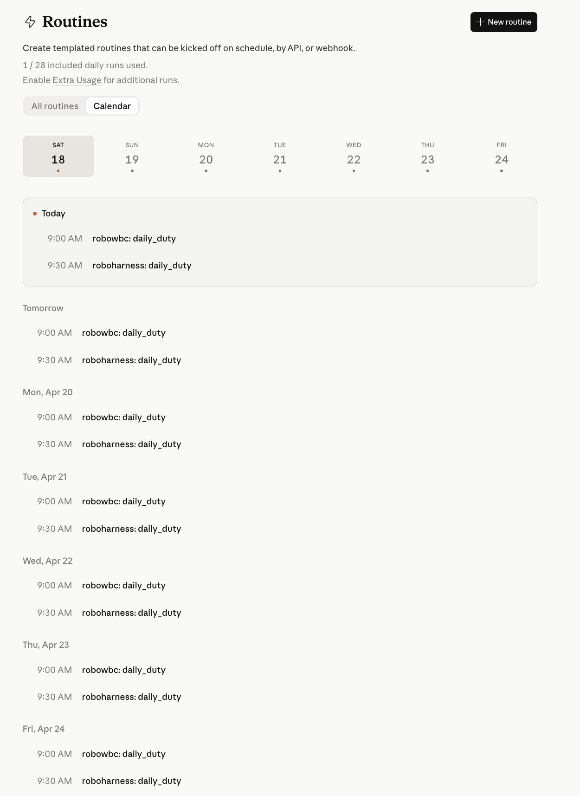
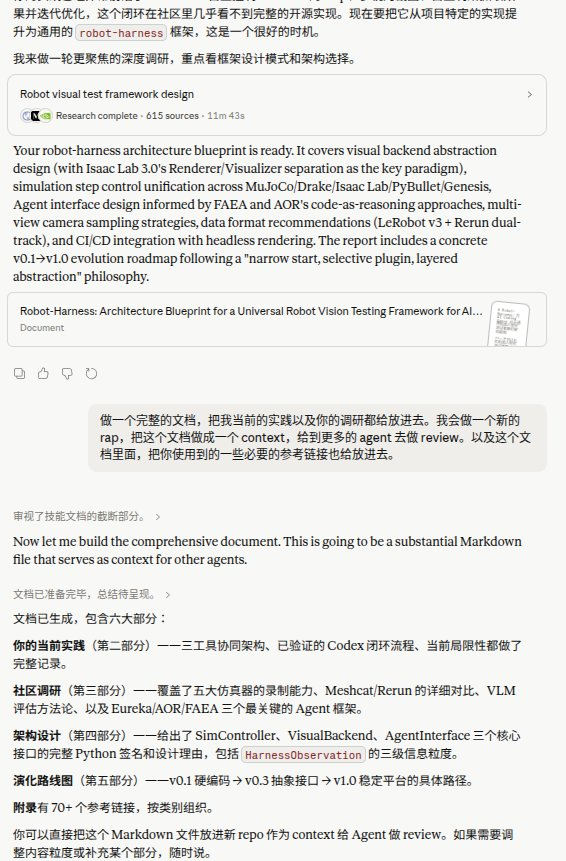
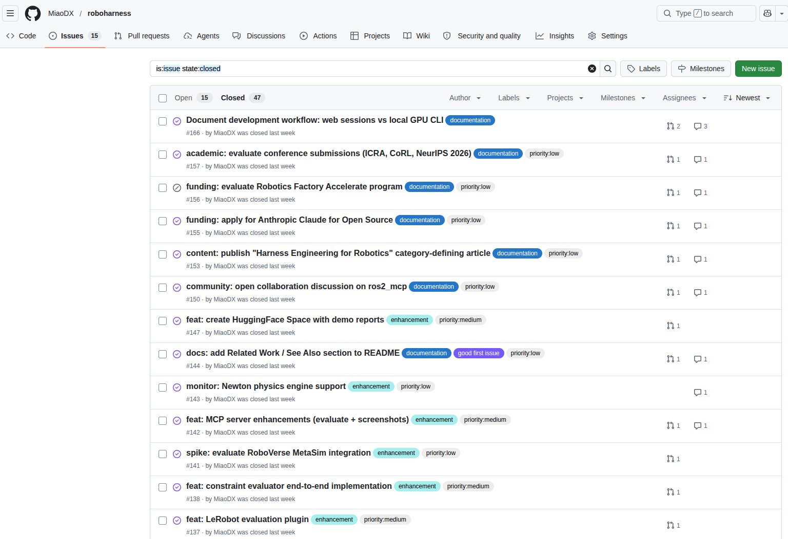
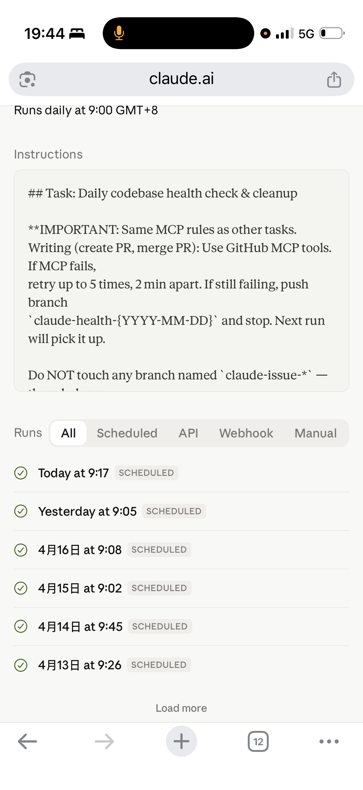
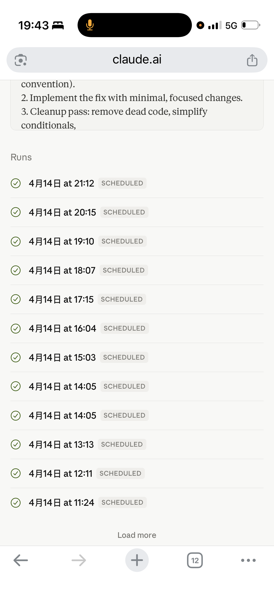
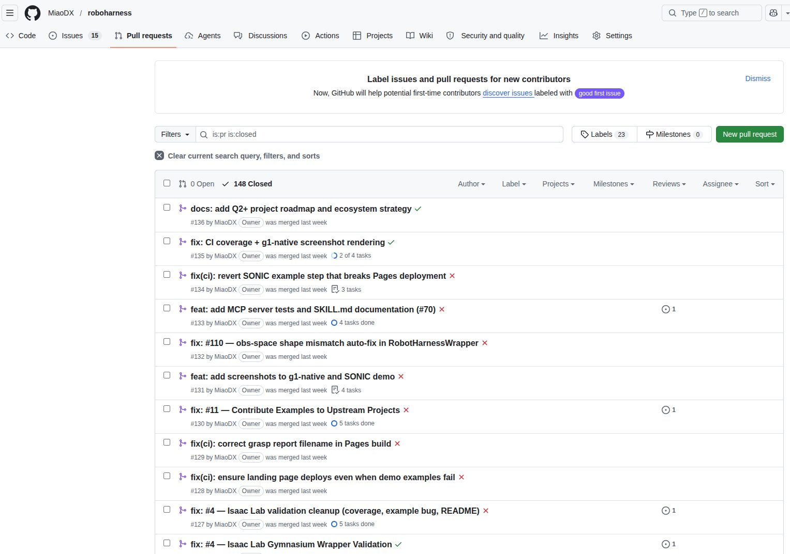
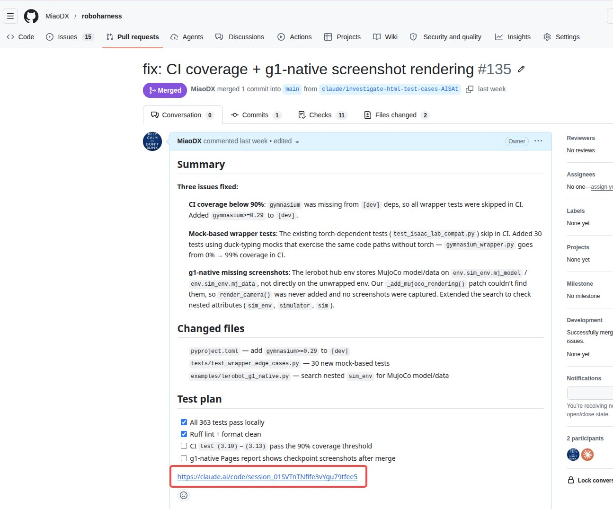

# 一个人 + 四个 Routine：让 Claude Code 替我们打理开源项目

> 发布时间：2026 年 4 月 18 日

---

## Routines：Opus 4.7 更新里容易被漏掉的那一条

Anthropic 最近的更新节奏挺密的。Opus 4.7 一发布就成了讨论的焦点，各种 benchmark 和 coding 实测满天飞。但同一轮更新里还有一条相对低调、其实影响可能更深远的改动：**Claude Code 把之前云端的 scheduled 任务整体升级成了 Routines，并且开放了 API 和 GitHub Webhook 作为触发方式**。

之所以说它影响深远，是因为这释放了一个很强的信号：**Anthropic 在认真往"云端 agent"这个方向做投入，而不是把 scheduled 任务当成一个聊胜于无的小工具**。从一个独立 CLI 命令升级成独立的产品形态、加上三种触发方式、再配合官方在 routine 里默认只允许推到 `claude/` 前缀分支的安全栏——这不是"顺手加点功能"，是一个明确的产品定位。

这篇文章想分享的是：**基于 Routines 能搭出一套怎样的研发流程——让一个人也能快速把一个新想法做到 60 分，并且之后基本能自主运行**。这套流程目前在 [roboharness](https://github.com/MiaoDX/roboharness)（机器人仿真的视觉 harness，上一篇公众号介绍过）和 [robowbc](https://github.com/MiaoDX/robowbc)（roboharness 的全身控制 showcase）两个开源仓库上在跑。

**整套流程的人类操作都可以在手机上完成**——这是 Routines 带来最直接的体验变化。Claude 手机 app 里和 Opus 聊、GitHub 移动端拆 issue、claude.ai/code/routines 看状态、PR 走 GitHub review 合入。对设备的要求变成了"一个能上网的屏幕"，不再绑定工作站。



这套流程不是要代替现有的研发方式。需要深度调试、硬件交互、细节调优的事情还是要坐回电脑前。但对于"新想法快速落地"这种场景——交给云端 agent 跑的效率比自己坐下来干高得多，因为根本不需要腾出专门的时间段。

---

## 核心模式：从一个想法开始，到 agent 接手

真正值得分享的核心 pattern 其实很简单：

1. **和 Claude Opus 一起把想法变成 roadmap**
2. **把 roadmap 拆成 GitHub issues**——每个 issue 一个明确的小目标
3. **让 agent 挨个把 issue 解掉**——每小时一个，跑起来就不用管

第 1 步的实际过程比"聊 roadmap"三个字要厚得多，值得单独展开。

一个新想法刚冒出来的时候，通常是模糊的——知道大致方向，但不知道市面上有哪些已有方案、技术选型该怎么选、到底要解决什么别人没解决的问题。这时候会把想法抛给 Claude Opus 做一次 deep research——让它爬几百个网页、读相关 GitHub 仓库、翻论文、对比已有方案。一轮调研下来会得到一份相对粗糙的初版 plan。



**但初版 plan 离能拆 issue 还差很远**。接下来会围绕这份 plan 反复聊——挑战它的技术选型、质疑某些步骤的必要性、让它解释为什么某个方案比另一个更合适、补充一些它漏掉的边界情况。这个讨论过程往往要来回几十轮，plan 会被不断推翻、重写、细化。

等到 plan 本身经得起反复推敲了，才会形成真正能落地的 roadmap——里面每一步都是具体、可验证、可以拆成 GitHub issue 的颗粒度。

**这一步做得好不好，直接决定了后面 agent 能跑多远**。一个含糊的 roadmap 拆出的 issue 也是含糊的，含糊的 issue 给到 auto_pr 就是垃圾进垃圾出。所以这一步虽然慢，但不能省。

第 3 步具体怎么实现，是可以有不同设计的。我们目前用了四个 routine 来实现——一个主力 + 三个辅助——但这只是一种落地方式。随着 Routines 本身的稳定性提升、以及大家对这种工作流的理解加深，这四个 routine 的结构未必是终态。

下面先讲现在这套四 routine 的分工，然后讲它们之间怎么协作、怎么兜底；最后谈谈下一步可能的升级方向。

---

## 为什么必须是云端

云端和本地差的不是速度，是**物理学**。三层差异缺一不可：

**一、一致性。** 每个人电脑上的 Python 版本、CUDA、系统依赖都不一样，同一个任务跑出不同结果是常态。Routines 跑在 Anthropic 管理的标准容器里——只要把 `uv.lock`、`Dockerfile`、CI 都配好，每一次 agent 看到的环境都是同一个。对开源项目尤其关键：贡献者门槛会低一个数量级。

**二、持续性。** 本地跑 Claude Code，合上电脑就停了。Routines 在云上跑，人睡觉时它在干活。对仿真这种单次要跑十几分钟的任务，这不是便利问题，是能不能做的问题。

**三、设备解耦。** 前面提到所有操作都可以在手机上完成。这个看似小的改变其实意味着：**agent 的工作周期和人的工作周期彻底解耦**。它按自己的节奏每小时跑一次，我们按自己的节奏在任何一个空档 review 产物——不需要同步。

Anthropic 在讲 long-running agent 的时候有一个类比很到位：**"一个软件项目由一群轮班工程师维护，每个人来的时候都没有上一班的记忆"**。

放到 routines 场景下非常合适。每一次 auto_pr 都是一个新班次——它不记得上一次谁干了什么，只能通过 repo 里留下的痕迹（代码、issue、comment、label）来推断"现在该干什么"。

**所以真正的工作不是写 prompt，是给这些轮班工程师设计工作环境**——让他们即使没有记忆，也能顺畅接班。

---

## 架构总览：四个 Routine 各自解决什么问题

每一个 routine 都有一个具体要解的问题，不是为了分工而分工：

```
                 Opus 聊 roadmap（人 + 手机）
                         ↓
                   GitHub Issues（backlog）
                         ↓
        ┌────────────────┼────────────────┐
        ↓                ↓                ↓
   issue_label       auto_pr          （人做方向把控）
   （每天）           （每小时）
   打标签排优先级      挑 issue → 改代码 → PR
                          ↓
                   GitHub Comments
                   （agent 间的消息）
                          ↓
        ┌─────────────────┴──────────────────┐
        ↓                                    ↓
    pr_again                           daily_duty
    （每天）                            （每天）
    孤儿分支救回                         CI 修复 + cleanup
```

> 上图后续会替换为 SVG 架构图。重点突出 GitHub 居中的位置——所有 routine 都通过 GitHub 的 issue / comment / branch 来协作，没有额外的 orchestration 服务。

**auto_pr 是核心，其他三个都是辅助**。

- **auto_pr**：解 issue 是整套流程里最核心的动作，所以它每小时跑一次，产能最高
- **issue_label**：因为 issue backlog 会不断增长，而且新 issue 随时会加进来。如果只按 issue 编号从小到大解，很容易错过真正紧急的问题——所以需要一个 routine 专门负责优先级排序，让 auto_pr 每次挑的都是"当前最该解的那一个"
- **pr_again** 和 **daily_duty**：这两个本质上都是**兜底**。目前 Claude Code 的 MCP 工具链在 create PR / merge PR 这些写操作上还不完全稳定——推上去的代码有时候建不成 PR、PR 建了有时候合不进去。这两个 routine 每天扫一次，把这些遗漏的工作接起来

如果将来 MCP 工具足够稳定、一次性成功率接近 100%，**pr_again 和 daily_duty 的大部分职责其实是可以退化的**。它们现在的存在价值很大程度上来自当前工具的不完美。这一点后面会再谈。

四个 routine 共用同一个仓库、并行工作。Routine 官方默认只允许推到 `claude/` 前缀的分支，这是一道官方保护栏。在这道栏的基础上，**我们又给每个 routine 约定了一个更细的分支前缀**，让四个 routine 之间不互相踩脚：

- auto_pr 只碰 `claude-issue-*`
- daily_duty 只碰 `claude-health-*` 和 `claude-ci-fix-*`
- pr_again 只碰 `claude-cleanup-*`
- issue_label 什么分支都不碰（只读 + 打标签）

四个 routine 就像四个身份独立、职责严格不重叠的同事。它们之间从来不直接通信，全部通过 GitHub 本身的 issue、comment、label、branch 来协作——没有搭任何额外的消息队列、也没有部署任何 orchestrator。**GitHub 原生的协作基底已经够用了**。

---

## 四个 Routine 的细节

### 1. auto_pr（每小时）——主力

职责：挑一个 open 的 issue，改代码，推 PR，自评，该合就合。

prompt 里最值得分享的不是"怎么写代码"，而是两个结构：**断点续传 + 三态自评**。

**断点续传**：每次启动先检查有没有名为 `claude-issue-*` 但没有关联 PR 的分支。有的话——这是上一轮没收尾的活，先把它干完，再去碰新的。

**三态自评**：PR 推上去后，agent 要自己判断三种状态：

- **FULLY RESOLVED**：完全搞定 → 合入 + 关 issue
- **PARTIALLY DONE**：做了一半 → 合入 + 在 issue 下留 checklist 说明哪些完成了、哪些没
- **DIMINISHING RETURNS**：卡住了 → 留 `[deferred]` comment + 退出

> 三态自评决策流的树状图后续会补充 SVG。

为什么这样设计比"要求 agent 每次都做完美"效果好？因为逼 agent 装完美会让它走火入魔——它会编造完成度、会修改不该动的地方、会开始 hallucinate。**给它一个"做一半也 OK"的出口，它反而会诚实汇报**。

### 2. issue_label（每天）——排优先级

职责：读所有 open issue，给每个打 label 分优先级，该关的关掉。

这个 routine 之所以必要，前面已经提到——**backlog 是动态增长的，新 issue 随时会加进来，如果没有专门的优先级梳理机制，auto_pr 很容易错过真正紧急的问题**。

prompt 最关键的一行是开头那句大写警告：

> **"Do NOT push any commits, create any branches, or open any PRs. This task ONLY labels/closes issues."**

**即使 MCP 工具可用也禁止写代码**。

LLM 在 context 变长后会"手痒"——读到一个有 bug 描述的 issue，它会想"顺手修一下吧"。但那不是这个 routine 的职责。这种写权限的物理隔离很关键，后面会单独讲。




### 3. pr_again（每天）——孤儿分支救援

解决的问题很具体：**auto_pr 有时候代码推上去了但 PR 没建成**。可能是 MCP 工具那一下挂了、可能是遇到冲突卡住、可能是自评失败退出。这些分支如果没人管，就是死代码。

pr_again 的工作：

1. 列出所有 `claude-issue-*` / `claude-health-*` / `claude-cleanup-*` 但没有关联 PR 的分支
2. 挨个评估：能自动建 PR 就建、有冲突就留 `[conflict]` comment、测试挂了就留 `[ci-fail]` comment

这一环是整套设计里最顺的部分。**auto_pr 失败的时候不会默默丢失**——它会在对应 issue 下留一条 `[auto-pr]` comment。pr_again 第二天就扫这些 comment 过来接手。

换句话说，**GitHub issue 的 comment 就是 agent 之间的异步消息**。auto_pr 留下 `[auto-pr]`、pr_again 留下 `[conflict]` 或 `[ci-fail]`、daily_duty 留下 `[deferred]`——每一个前缀都是一个消息类型，每一条 comment 都是一条消息。

没有部署任何消息队列，没有用任何外部 orchestration。**GitHub 自己就是消息总线**。

### 4. daily_duty（每天）——代码健康 + CI 兜底

职责：每天扫一遍 repo，看 CI 挂没挂、有没有 bad smell、有没有该清的 dead code。

关键的一条约束写在 prompt 头部：

> **"Do NOT touch any branch named `claude-issue-*` — those belong to the issue-processing task."**

**分支命名空间不越界**。daily_duty 再想帮忙，也不能去碰 auto_pr 的分支——那会让 auto_pr 下一次启动的断点续传逻辑错乱。

这条约束来自一次实际翻车：daily_duty 当时想"帮 auto_pr 把分支合进去"，结果两个 routine 互相踩脚。加了这条约束之后问题再没出现过。

这种"**每次发现 agent 犯一类错，就做一个机制确保它不再犯**"的过程，其实就是 Mitchell Hashimoto 说的 engineer the harness。daily_duty 本身也是这套思路的产物——它作为一个 meta-routine 存在，专门兜底其他 routine 的日常故障。



---

## 暗线：四个 Agent 怎么不打架

上面每一节都提到了协作细节，这里单独拎出来讲——因为这是整套系统最容易被忽略的设计。

**两条隐性协议构成了全部协作基础**：

**一、分支命名空间隔离**。`claude-issue-*` / `claude-health-*` / `claude-ci-fix-*` / `claude-cleanup-*`——每个 routine 有自己的 playground，**物理上不会踩脚**。

**二、GitHub comment 作为消息协议**。`[auto-pr]` / `[ci-fail]` / `[deferred]` / `[conflict]` 这些前缀就是 agent 之间的消息。一个 routine 留 tag，另一个 routine 扫 tag 接手。

就这两条。没有中心调度器，没有 orchestration 服务，没有专门的消息队列。

这个设计有点像 Erlang 的 actor model 哲学——**独立失败、通过消息协作**。只不过这里的消息不是 process mailbox，是 GitHub 的 issue comment；actor 不是 BEAM process，是 Claude Code routine。

GitHub 已经为人类团队提供了一整套协作原语（issue、comment、label、branch、PR），我们只是把同样的原语用到 agent 身上。**不需要发明新东西**。

---

## 无人值守 Prompt 的四个关键模式

上面四个 routine 的 prompt 细节散在各处，这里总结成四个可以直接复用的模式。

一个基本观察：**无人值守的 prompt 不是交互式 prompt 的简化版，是另一种东西**。交互式可以模糊、可以靠后续回合澄清；无人值守没有下一回合——任何模糊都会被放大成失败。

这四个模式是反复踩坑后总结出来的：

**模式一：三态自评**

不要假设 agent 每次都能完成任务。给它三种明确的结束状态（做完 / 做一半 / 卡住），让它诚实汇报。这比逼它装完美有效得多。

**模式二：MCP 工具失败的显式降级**

每个 prompt 里都会明确写：MCP 失败怎么办。比如 auto_pr 的 PR 创建失败时——重试 5 次，每次间隔 2 分钟；仍然失败就在 issue 下留 `[auto-pr]` comment + 停止。**不要让 agent 自己决定怎么处理失败**，指定一条明确的降级路径。

**模式三：读写权限的物理隔离**

issue_label 不写代码。daily_duty 不碰 auto_pr 的分支。pr_again 不开新 issue。每个 routine 的能力边界用大写警告 hard-code 在 prompt 顶部，不给它"顺手帮忙"的空间。

**模式四：分支命名空间不越界**

每个 routine 有自己的分支前缀，严格不跨越。这看起来像 trivial 的约定，但**它是四个 routine 能并行跑而不互相破坏彼此 state 的唯一原因**。

这四个模式加在一起，本质上都在回答同一个问题：**"如果 agent 失败了，下一次运行会发生什么？"**

如果答案是"下一次能识别前一次的残留并正确处理"——这个 routine 就可以无人值守。如果答案是"不确定，可能会重复做、可能会踩脚、可能会把事情搞得更糟"——这个 routine 还没准备好上线。

---

## 实测：跑了多久，产出如何

光讲设计没用，看数据。







最后那张截图有个细节值得注意：PR 的描述底部贴了一条 `https://claude.ai/code/session_01SVTnTNfife3vYgu79tfee5` 这样的链接——这是 routine 执行时的云端 session 记录。点进去能看到 agent 当时的完整思考过程、用了哪些工具、改了哪些文件。对 review PR 非常有帮助：**人 review 的时候不只能看到最终代码，还能看到代码是怎么产生的**。

**诚实话**：这套东西目前还在调试期。截图里的大部分 routine 显示 Paused，是因为还在迭代 prompt——每次发现一类错误就暂停对应 routine，修改 prompt 重新上线。不是"搭好了就永远稳"。

**翻过的车**：

- auto_pr 曾经把同一个 issue 重复处理了两遍——加了"检查是否已有 `claude-issue-{number}` 分支"的步骤兜底
- daily_duty 曾经去合 auto_pr 的分支、和 auto_pr 撞车——加了"不碰 `claude-issue-*` 分支"的约束
- issue_label 曾经"顺手"改了一个 issue 里 mention 的 bug、提了个 PR——加了大写的"ONLY labels/closes issues"禁令

每一次翻车都变成 prompt 里多一行约束。这就是 harness 的日常迭代——不是写完一次就完事，是随着 agent 出错、不断把错误机械化地封住。

---

## 适用边界：不是银弹

**适合的场景**：

- 产出**可视化强**的项目（CI 能自动出 HTML + 截图，人眼一扫就能判断好坏）
- **新想法到原型阶段**（60-70 分目标）
- 工具类、SDK 类、有明确 spec 的功能
- **独立模块较多**的 repo（agent 并行不容易互相踩脚）

**不适合的场景**：

- 深度调试（需要在本地看内存、观察进程、用 profiler）
- 硬件交互（传感器、真实机器人）
- 产出无法自动验证的（主观审美、创意文字）
- 需要跨服务复杂状态的（线上数据库迁移、生产事故复盘）

**心态**：把 routine 当 senior intern 用——能干很多活，但需要设计好它的工作环境、兜底机制、明确的"我干完了"信号。不是当 senior engineer 用。

---

## What's Next：把调度权也交出去

目前所有的 routine 还是 schedule 触发——朴素，但没有利用上 Routines 现在开放的另外两种触发方式：**API 和 GitHub Webhook**。

有了这两种触发方式，routine 不再是单纯的"定时任务"，而是**可以被其他 agent 调用的可编程节点**。

接下来想试的方向是把 OpenClaw 接进来作为一个 meta-level 的调度层。

当前这套四 routine 的架构里，**调度逻辑其实是人定下来的——哪个 routine 跑什么频率、谁先谁后、出问题怎么兜底**，这些决策是我们在配置 routine 的时候写死的 schedule。但这些决策本身也是有规律的：

- 如果最近新 issue 涌入很多，issue_label 应该先跑一次，然后 auto_pr 再挑
- 如果 PR 合入成功率在下降，pr_again 可能需要加频
- 如果 CI 最近频繁挂，daily_duty 应该优先处理修复而不是 cleanup

**这些判断完全可以交给一个 meta-level 的 agent 来做**。OpenClaw 擅长常驻运行 + 自然语言交互——它可以接入飞书或者 Slack，一方面接收人随手发的指令（"把 roboharness 最近 3 个 priority:high 的 issue 处理掉"），一方面根据当前 repo 的状态自主决定触发哪个 routine。

这个方向如果走得通，**人的工作就从"配 schedule + review PR"进一步简化为"发几句话 + review PR"**。从"人做调度，agent 做执行"，升级到"agent 做调度，agent 做执行，人只做方向和 review"。

现在这一步还没做。但 API 和 Webhook 的能力已经在那里了，值得试一下。

---

## 收尾

整套流程一句话总结：**Opus 聊方向 → 拆 issue → auto_pr 每小时干一点 → daily routines 每天兜底 → 人只做 review 和方向把控**。

几个核心设计点：

- **四个 routine 职责严格不重叠**（auto_pr 主力 + 三个辅助）
- **分支命名空间物理隔离**
- **GitHub comment 作为 agent 间的消息协议**
- **无人值守 prompt 要回答"失败后下一次怎么办"**

这套东西不是最终形态。随着模型能力提升、MCP 工具稳定性改善、以及 Routines 自己的演化，很多现在看起来必要的兜底机制将来可能都会退化。但这个骨架在两个开源项目上跑得还算稳，分享出来希望对大家有用。

如果手头也有个想法想快速做出来，不妨试一下这条路径。

---

## 项目链接

- [roboharness](https://github.com/MiaoDX/roboharness) — 机器人仿真的视觉 harness
- [robowbc](https://github.com/MiaoDX/robowbc) — roboharness 的全身控制 showcase

## 参考

- [Introducing routines in Claude Code](https://claude.com/blog/introducing-routines-in-claude-code) — 官方发布公告，2026-04-14
- [Routines 文档（中文）](https://code.claude.com/docs/zh-CN/scheduled-tasks)
- 四个 routine 的完整 prompt：[后续会挂到本 repo 的 prompts 目录]
