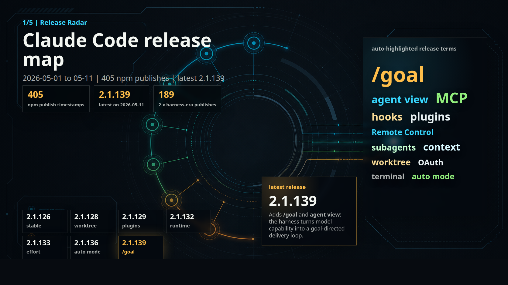
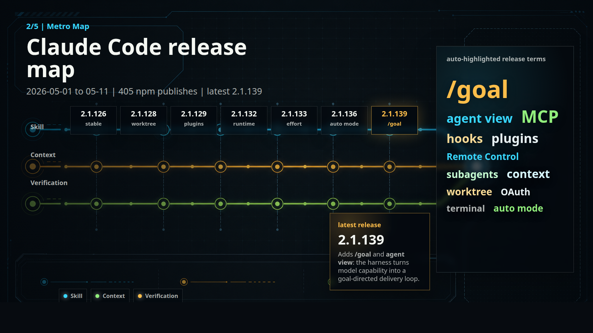
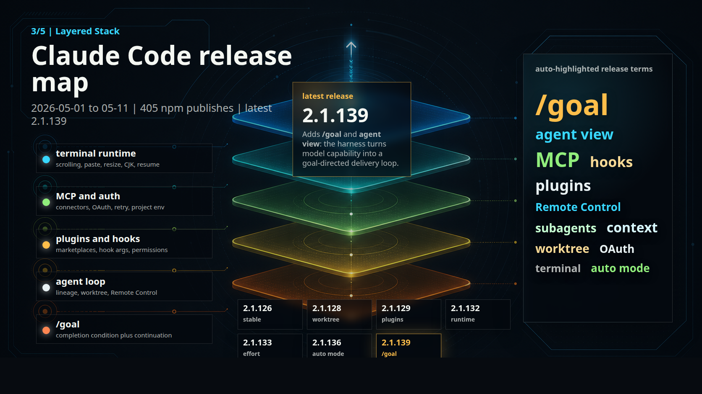
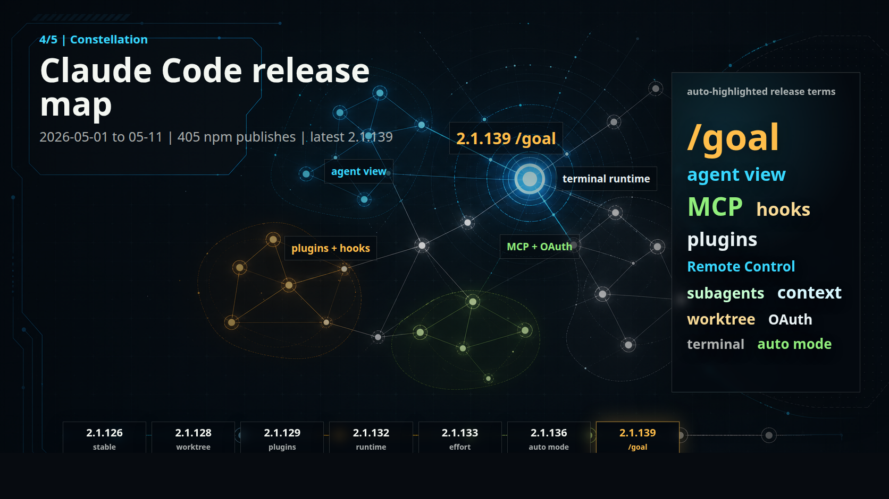
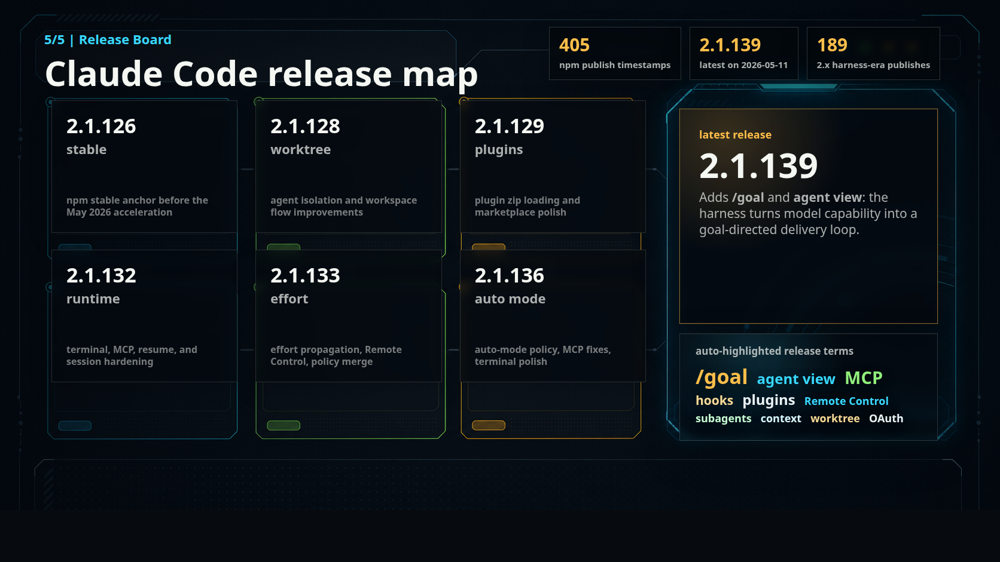
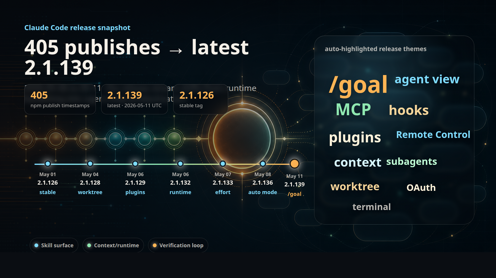

# Claude Code release timeline snapshot — 2026-05-11 UTC

用途:今晚 deck 第 09 页的 Claude Code release 数字和 timeline 口径复查。

## Sources

- Official Claude Code changelog: <https://code.claude.com/docs/en/changelog>
- npm package page: <https://www.npmjs.com/package/@anthropic-ai/claude-code>
- npm registry commands run on 2026-05-12 Asia/Shanghai:
  - `npm view @anthropic-ai/claude-code version`
  - `npm view @anthropic-ai/claude-code dist-tags --json`
  - `npm view @anthropic-ai/claude-code time --json`

## Deck-safe headline

As of `2026-05-11T23:59:59Z`, the npm timeline contains **405 publish timestamps** for `@anthropic-ai/claude-code`.

- `latest`: `2.1.139`
- `next`: `2.1.139`
- `stable`: `2.1.126`
- npm package `modified`: `2026-05-11T18:43:30.297Z`
- latest publish timestamp: `2.1.139` at `2026-05-11T18:09:28.537Z`

## Visual map candidates

The existing map is kept below for comparison. The five new candidates combine AI-generated visual bases with deterministic HTML/CSS overlays, so release numbers and word-cloud terms remain readable and reviewable.

| Candidate | Preview |
|---|---|
| v1: Release Radar |  |
| v2: Metro Map |  |
| v3: Layered Stack |  |
| v4: Constellation |  |
| v5: Release Board |  |

Overlay source: `assets/claude-code-release-map-candidates-2026-05-11.html`

### Existing map

## Era counts used in the slide

| Era | Version family | Publish timestamps |
|---|---:|---:|
| Vibe | `0.2.x` | 95 |
| SDD | `1.0.x` | 121 |
| Harness | `2.x` | 189 |
| Total | all | 405 |

## Milestone table used in the timeline

| Index | Version | npm publish timestamp | Deck label |
|---:|---|---|---|
| 25 | `0.2.44` | `2025-03-15T01:04:24.513Z` | ultrathink |
| 28 | `0.2.47` | `2025-03-18T01:42:37.884Z` | auto compact |
| 80 | `0.2.107` | `2025-05-09T16:15:03.847Z` | `@import` |
| 127 | `1.0.33` | `2025-06-23T20:31:06.405Z` | plan mode |
| 132 | `1.0.38` | `2025-06-30T20:29:03.323Z` | hooks |
| 135 | `1.0.41` | `2025-07-02T17:45:22.596Z` | subagents |
| 187 | `1.0.94` | `2025-08-27T20:13:08.204Z` | `/todos` |
| 233 | `2.0.20` | `2025-10-16T16:01:05.689Z` | skills |
| 243 | `2.0.30` | `2025-10-30T22:23:48.671Z` | subagents v2 |
| 379 | `2.1.107` | `2026-04-14T05:18:14.905Z` | routines |
| 396 | `2.1.126` | `2026-04-30T20:30:34.530Z` | npm stable / Codex `/goal` side marker neighborhood |
| 400 | `2.1.132` | `2026-05-06T19:10:04.541Z` | managed agents |
| 405 | `2.1.139` | `2026-05-11T18:09:28.537Z` | latest |

## Full release-note dump

The bullets below are a complete review dump of the official changelog entries that matter for the 05-11 deck update. They are paraphrased for local notes, with command names and setting names preserved exactly.

### `2.1.139` — 2026-05-11

npm timestamp: `2026-05-11T18:09:28.537Z`
Official changelog item count: 50

- Adds `claude agents`, an agent-view research preview that lists Claude Code sessions by state: running, waiting on the user, or finished.
- Adds `/goal`, which lets a user set a completion condition and lets Claude continue across turns until the condition is satisfied; it works in interactive mode, `-p`, and Remote Control, with an elapsed/turn/token overlay.
- Adds `/scroll-speed` with live preview for mouse-wheel tuning.
- Adds `claude plugin details <name>` so users can inspect a plugin component inventory and estimated per-session token cost.
- Adds transcript navigation shortcuts: `?` for help, `{` and `}` between user prompts, and `v` for the shortcut panel.
- Adds hook `args: string[]` exec form so commands can run without shell quoting around path placeholders.
- Adds hook `continueOnBlock` for `PostToolUse`; when enabled, hook rejection text is passed back into Claude and the turn can continue.
- Gives stdio MCP servers `CLAUDE_PROJECT_DIR`, matching hook behavior, and allows plugin commands to reference `${CLAUDE_PROJECT_DIR}`.
- Updates compaction prompting so sensitive user instructions are preserved.
- Lets `/mcp` reconnect pick up `.mcp.json` edits without restarting; failed reconnects now show HTTP status and URL.
- Makes `/context all` estimate per-skill tokens with the active model tokenizer and rounded display.
- Makes `claude plugin install <name>@<marketplace>` refresh and retry before declaring a plugin missing.
- Improves installed-plugin details under `/plugin` so hook event names and MCP server names are readable.
- Shows the plugin provider name in `/context` for plugin-sourced skills.
- Enables retry for transient remote MCP reconnect failures for all users.
- Adds subagent lineage identifiers to API request headers and OTEL spans: `agent_id`, `parent_agent_id`, and matching `x-claude-code-*` headers.
- Disables Remote Control, `/schedule`, claude.ai MCP connectors, and notification preferences when API-key or auth-token based auth is active, even if Claude.ai login is also present.
- Fixes a credential-expiration deadlock that could block `claude auth login`, `logout`, and `status`.
- Fixes `autoAllowBashIfSandboxed` for commands using shell expansion such as `$VAR` and `$(cmd)`.
- Runs hooks without terminal access to avoid corrupting interactive prompts when hook output writes to the terminal.
- Caps non-protocol HTTP/SSE MCP response bodies at 16 MB per frame to avoid unbounded memory growth.
- Fixes `Skill(name *)` permission rules so wildcard matching behaves as prefix matching.
- Makes settings hot reload detect symlinked `~/.claude/settings.json`.
- Fixes plugin detail loading when marketplace key and manifest name differ.
- Makes the `/model` default row honor `ANTHROPIC_DEFAULT_OPUS_MODEL` and `ANTHROPIC_DEFAULT_SONNET_MODEL`.
- Fixes false stream-idle-timeout reports after a response completes by clearing the watchdog on cancellation.
- Improves the error path when many MCP servers are configured and the cache directory is unwritable.
- Removes stray blinking cursors from tab names, list markers, and dialog rows.
- Fixes transcript-view keyboard shortcuts after a mouse click.
- Fixes Bash-mode up-arrow history repeating the first entry and overwriting draft input.
- Fixes multi-image paste/drop so all images are inserted, not only the final one.
- Makes hyperlink colors adapt better on dark themes.
- Removes a redundant current-model row for third-party users whose model is set through the `opus` alias.
- Fixes a legacy Opus picker entry on PAYG third-party providers resolving to the same model as the default row.
- Normalizes mouse-wheel and trackpad behavior in Cursor and VS Code 1.92-1.104 integrated terminals.
- Fixes Windows Terminal and VS Code scrolling when attached to background sessions.
- Removes disconnected MCP resources from `@server:` autocomplete.
- Fixes two-file diff snippets overcounting truncated lines by one.
- Fixes Windows drive-letter path relativization and incorrect single-file totals in Grep count mode.
- Fixes CJK and emoji cell-width math in border-embedded text.
- Fixes fuzzy-match highlighting splitting emoji or astral-plane characters.
- Fixes skill argument substitution when argument names include regex metacharacters.
- Fixes ProgressBar fractional-cell rendering near 100%.
- Stops task polling and `fs.watch` from being revived after the last subscriber leaves during an in-flight fetch.
- Fixes plugin dependency resolution leaving stale counts when manifest and source names differ.
- Fixes Insights time-of-day charts when a session includes an unparseable timestamp.
- Fixes parsing for keybindings that only use cmd/super/win modifiers.
- Emits `claude_code.active_time.total` in `--print` mode.
- Preserves cross-plugin symlinks inside a marketplace during `claude plugin update`.
- Adds a VS Code shortcut to reopen the most recently closed session tab with Cmd/Ctrl+Shift+T, controlled by `claudeCode.enableReopenClosedSessionShortcut`.

### `2.1.138` — 2026-05-09

npm timestamp: `2026-05-09T05:57:28.355Z`
Official changelog item count: 1

- Internal fixes.

### `2.1.137` — 2026-05-09

npm timestamp: `2026-05-09T00:04:08.277Z`
Official changelog item count: 1

- Fixes VS Code extension activation on Windows.

### `2.1.136` — 2026-05-08

npm timestamp: `2026-05-08T16:30:41.957Z`
Official changelog item count: 52

- Adds `CLAUDE_CODE_ENABLE_FEEDBACK_SURVEY_FOR_OTEL` for enterprises that want session-quality survey responses in OpenTelemetry.
- Adds `settings.autoMode.hard_deny` for unconditional auto-mode classifier blocks.
- Fixes `.mcp.json`, plugin, and claude.ai connector MCP servers disappearing after `/clear` in VS Code, JetBrains, and Agent SDK contexts.
- Fixes a rare login loop where concurrent credential writes could overwrite a freshly rotated OAuth token.
- Fixes concurrent MCP OAuth refreshes losing refresh tokens across multiple remote MCP servers.
- Fixes 400 API errors caused by extended-thinking redacted blocks after tool calls.
- Fixes `--resume` and `--continue` session lookup when project paths contain underscores.
- Fixes plan mode allowing file writes when an `Edit(...)` allow rule matched.
- Adds a WSL2 PowerShell fallback for image paste when `xclip` or `wl-paste` cannot read image data.
- Fixes plugin `Stop` and `UserPromptSubmit` hooks when cache cleanup removes a still-running version.
- Standardizes slash-command dialog footer hints, spacing, arrow-key styling, and initial frame rendering.
- Fixes misplaced colors in Bash output and markdown code blocks.
- Fixes ReasonML word-diff rendering artifacts.
- Fixes worktree exit dialog warnings pointing at the wrong directory after worktree removal.
- Fixes `@` file picker freshness in small non-git directories.
- Fixes `@` mention search in directories containing more than 100 entries.
- Fixes failed tool-call expansion in fullscreen mode when output was truncated.
- Fixes Backspace and Ctrl+Backspace after Ctrl+G external-editor use in terminals with persistent extended-key modes.
- Fixes `/usage` weekly reset display to show the calendar date rather than time of day.
- Fixes CJK terminal overflow from welcome-banner ellipsis.
- Fixes `/insights` crashes on malformed tool-call input in session history.
- Fixes a renderer crash when a tool collapsibility classification changes mid-session.
- Fixes plugin `skills` declarations hiding default plugin `skills/`; file-path entries now surface errors instead of failing silently.
- Makes IDE shell-integration lock files respect `CLAUDE_CONFIG_DIR`.
- Removes trailing whitespace from copied terminal output during streaming.
- Makes plugin uninstall and enable/disable match slugs case-insensitively.
- Fixes negative truncation counts for surrogate-pair strings.
- Refreshes `CLAUDE_ENV_FILE` SessionStart-hook env vars after `/resume` and `/clear`.
- Prevents `/branch` from saving pasted multi-line text as a multi-line session title.
- Fixes stray leading space on wrapped text at a column boundary.
- Makes Esc dismiss dialogs for `/install-github-app`, `/desktop`, `/resume`, and `/web-setup`.
- Improves `/doctor` MCP schema errors by naming missing fields and source files.
- Replaces internal Bash permission-parser diagnostics with user-readable permission text.
- Resolves plugin slash commands containing spaces to the correct namespaced command.
- Fixes `AskUserQuestion` multi-select answers when provided as arrays.
- Labels sessions cleared with `/clear <name>` so `/resume` can identify them.
- Restores qualifiers and scheduled prompt text in `CronList` output.
- Fixes “Jump to bottom” fullscreen color artifacts on CJK characters.
- Fixes wide markdown table border residue in terminal scrollback during streaming.
- Prevents long pasted prompts with placeholder truncation from dropping pasted text silently.
- Fixes `/release-notes` staying pinned to an older version after changelog refresh failure.
- Makes `/mcp` server lists scroll when the terminal cannot show all servers.
- Fixes mid-input slash-command autocomplete after an initial slash command.
- Stops bottom scrolling from re-enabling auto-follow when `autoScrollEnabled` is false.
- Prevents Enter on an empty prompt from auto-submitting prompt suggestions.
- Makes keyboard shortcut hints reflect custom bindings from `keybindings.json`.
- Prevents `/settings` language changes from reverting on Escape after confirmation.
- Improves `/terminal-setup` autocomplete so partial prefixes work.
- Preserves question text when using “Chat about this” on an `AskUserQuestion` dialog.
- Fixes hidden MCP tool results when the server returns content blocks.
- Improves `--worktree` collision errors for existing or stale worktrees.
- Changes plugin marketplace removal to `d` so it no longer conflicts with retry on `r`.

### `2.1.133` — 2026-05-07

npm timestamp: `2026-05-07T20:19:32.227Z`
Official changelog item count: 17

- Adds `worktree.baseRef` (`fresh` or `head`) to choose whether `--worktree`, `EnterWorktree`, and agent-isolation worktrees branch from `origin/<default>` or local `HEAD`.
- Adds managed `sandbox.bwrapPath` and `sandbox.socatPath` settings for Linux/WSL custom binary locations.
- Adds `parentSettingsBehavior` with `first-wins` or `merge` for SDK `managedSettings` policy merge behavior.
- Passes effort level to hooks through `effort.level` JSON and `$CLAUDE_EFFORT`, and exposes `$CLAUDE_EFFORT` to Bash commands.
- Improves focus mode behavior.
- Reduces memory pressure by releasing warm-spare background workers when needed.
- Fixes parallel sessions all ending with 401 after refresh-token races.
- Fixes root-scoped `Edit` and `Write` allow rules such as `C:\` or `/` matching incorrectly.
- Fixes `ECOMPROMISED` unhandled rejection from history/session-log file-lock issues.
- Fixes false compaction error notification when pressing Esc during compaction.
- Makes the full MCP OAuth flow respect `HTTP(S)_PROXY`, `NO_PROXY`, and mTLS.
- Fixes Read/Write/Edit denial on mapped network drives passed with `--add-dir` or SDK `additionalDirectories`.
- Makes Remote Control stop/interrupt from claude.ai cancel CLI sessions like local Esc, preventing queued-message stalls.
- Fixes `/effort` changes leaking between concurrent sessions and related dropped IDE effort updates.
- Fixes subagents failing to discover project, user, or plugin skills through the Skill tool.
- Adds `--remote-control` to `claude --help`.
- Fixes VS Code `claudeCode.claudeProcessWrapper` on extension builds without a bundled Claude binary.

### `2.1.132` — 2026-05-06

npm timestamp: `2026-05-06T19:10:04.541Z`
Official changelog item count: 28

- Adds `CLAUDE_CODE_SESSION_ID` to Bash tool subprocesses, matching the hook `session_id`.
- Adds `CLAUDE_CODE_DISABLE_ALTERNATE_SCREEN=1` to keep the conversation in terminal scrollback instead of fullscreen alternate-screen mode.
- Adds a paste-progress footer while Ctrl+V image paste is read from the clipboard.
- Handles external SIGINT gracefully, restoring terminal modes and printing a resume hint.
- Fixes exceptions when a terminal closes or SSH disconnects mid-session under the native build.
- Fixes `--resume` failures caused by truncating emoji surrogate pairs in tool-error text; existing corrupted sessions are sanitized on load.
- Fixes `--permission-mode` being ignored when resuming plan-mode sessions with `-p --continue` or `--resume`, and restores plan mode after `ExitPlanMode`.
- Fixes blank fullscreen screen after sleep/wake or Ctrl+Z/`fg`.
- Fixes cursor placement inside Indic conjuncts or ZWJ emoji across wrapped lines.
- Fixes vim operators corrupting decomposed accented text.
- Fixes pasted text beginning with `/` being swallowed or treated as an unknown slash command.
- Fixes stray escape sequences during bracketed paste when focus or mouse-tracking events interleave.
- Fixes overly fast mouse-wheel scrolling in Cursor and VS Code 1.92-1.104.
- Fixes JetBrains IDE 2025.2 terminal wheel handling, including direction and runaway acceleration problems.
- Fixes `/usage` Ctrl+S hangs on Linux/X11 screenshot copy.
- Fixes contradictory `/terminal-setup` messaging in Windows Terminal.
- Makes `/effort` picker reflect `CLAUDE_CODE_EFFORT_LEVEL`.
- Fixes `/status` showing the wrong default model for some users.
- Lets slash-command autocomplete scale with terminal height instead of showing only a few entries.
- Fixes statusline `context_window` counts to show current context, not cumulative session totals.
- Fixes Alt+T thinking toggle on macOS terminals where Option is not Meta.
- Fixes dead keyboard input on Windows after reopening background sessions from `claude agents`.
- Fixes 10GB+ RSS growth from stdio MCP servers writing non-protocol stdout.
- Retries once and reports “connected, tools fetch failed” when an MCP server connects but `tools/list` fails.
- Reports unauthorized claude.ai MCP connectors as needing auth, and stops headless `-p` retries for non-transient 4xx failures.
- Improves slash-command, `/login`, `/upgrade`, and `/extra-usage` dialog visual consistency.
- Updates `/tui fullscreen` startup copy to mention memory, mouse, and select-to-copy benefits.
- Fixes Bedrock and Vertex 400s when `ENABLE_PROMPT_CACHING_1H` is set.

### `2.1.131` — 2026-05-06

npm timestamp: `2026-05-06T07:41:53.401Z`
Official changelog item count: 2

- Fixes VS Code extension activation on Windows caused by a bundled SDK `createRequire` path issue.
- Fixes Mantle endpoint auth missing the `x-api-key` header.

### `2.1.129` — 2026-05-06

npm timestamp: `2026-05-05T18:22:55.515Z`
Official changelog item count: 27

- Adds `--plugin-url <url>` to load a plugin zip archive from a URL for the current session.
- Adds `CLAUDE_CODE_FORCE_SYNC_OUTPUT=1` for terminals that miss synchronized-output autodetection.
- Adds `CLAUDE_CODE_PACKAGE_MANAGER_AUTO_UPDATE` so Homebrew or WinGet installs can background-upgrade and prompt for restart.
- Moves plugin `themes` and `monitors` declarations under `experimental`, with validation warnings for legacy top-level declarations.
- Makes gateway `/v1/models` discovery for `/model` opt-in with `CLAUDE_CODE_ENABLE_GATEWAY_MODEL_DISCOVERY=1`.
- Restores Ctrl+R history picker default search across all prompts and projects; Ctrl+S narrows to current scope.
- Removes first-party Anthropic spinner tips for third-party deployments such as Bedrock, Vertex, Foundry, or custom gateways.
- Makes `skillOverrides` work across `off`, `user-invocable-only`, and `name-only`.
- Counts PRs/MRs created through MCP tools in the `claude_code.pull_request.count` OTEL metric.
- Adds API Request ID to policy-refusal errors.
- Improves unknown 400 API errors by showing the underlying message rather than raw JSON.
- Fixes `/clear` leaving the old terminal tab title.
- Keeps `/rename` session title chips visible while dialogs are open.
- Restores the agent panel under the prompt while subagents are running.
- Fixes Ctrl+G external-editor handoff blanking prior conversation history.
- Stops `/context` from inserting its ASCII visualization into the conversation and wasting tokens.
- Fixes `/agents` library arrow navigation so highlighted entries remain in view.
- Adds the new branch session id to `/branch` success messages for `/resume`.
- Fixes fullscreen bold headers containing keycap, ZWJ, or skin-tone emoji.
- Fixes managed settings for enterprise/team users whose OAuth credentials lacked `user:inference`.
- Fixes wake-from-sleep OAuth refresh races that could log out running sessions.
- Fixes 1-hour prompt cache TTL being silently reduced to 5 minutes.
- Suppresses false cache-miss warnings after `/clear` or compaction when changing `/effort` or `/model`.
- Honors `Bash(mkdir *)`, `Bash(touch *)`, and similar allow rules for in-project paths.
- Fixes `deniedMcpServers` wildcard schemes with mixed-case hostnames.
- Stops harmless voice-mode WebSocket warnings from logging as errors in `--debug`.
- Fixes VS Code `/clear` so both context and displayed transcript are cleared.

### `2.1.128` — 2026-05-04

npm timestamp: `2026-05-04T19:29:23.662Z`
Official changelog item count: 37

- Makes bare `/color` choose a random session color.
- Shows connected-server tool counts in `/mcp`, including zero-tool warnings.
- Lets `--plugin-dir` accept zipped plugin archives.
- Enables `--channels` with console/API-key auth when managed settings allow channels.
- Cleans up `/model` picker duplication around Opus 4.7 and current Opus naming.
- Stops Bash, hooks, MCP, and LSP subprocesses from inheriting `OTEL_*` variables.
- Reserves `workspace` as an MCP server name and skips existing servers using it.
- Summarizes MCP re-announced tools by prefix instead of flooding the conversation on reconnect.
- Lets SDK hosts suggest persistent `localSettings` entries for Bash permission prompts.
- Makes `EnterWorktree` branch from local `HEAD`, preserving unpushed commits.
- Adds auto-mode error hints when the classifier cannot evaluate an action.
- Fixes focus mode briefly dimming the previous response after a new prompt.
- Fixes stray OSC notification text on `/exit` in Kitty-like terminals.
- Improves Remote Control rate-limit messaging.
- Fixes drag-and-drop image upload hanging when image read fails.
- Fixes crash loops from piping input larger than 10 MB into `claude -p`.
- Makes wrapped long URLs clickable on each row in fullscreen mode.
- Fixes `/plugin` component panel errors for plugins loaded through `--plugin-dir`.
- Preserves MCP result images when structured content and content blocks are both returned.
- Fixes copy-paste whitespace from fenced code blocks inside list items.
- Keeps `/config` tab headers focused so arrow keys and Esc continue working.
- Shows markdown links as `label (url)` when OSC 8 hyperlinks are unavailable.
- Avoids false prompt-length blocking for 1M-context models with smaller autocompact windows.
- Prevents failed read-only parallel shell commands from canceling sibling calls.
- Hides effort text on models that do not support effort.
- Fixes `/fast` on third-party providers fuzzy-matching to an unrelated skill.
- Fixes Bedrock default-model region prefix resolution.
- Makes vim NORMAL-mode Space move right, matching vim.
- Keeps terminal progress indicator visible across a whole turn instead of flickering between tools.
- Fixes `/rename` without arguments on resumed sessions after compact boundaries.
- Removes stale remote-control status lines after `--resume` or `--continue`.
- Removes stale deleted plugin-cache paths from PATH.
- Fixes MCP stdio arguments when `CLAUDE_CODE_SHELL_PREFIX` is set and arguments contain spaces or shell metacharacters.
- Adds subagent progress summaries to reduce prompt-cache creation.
- Fixes `/plugin update` not detecting newer npm-sourced plugin versions.
- Stops repeated static subagent summaries to cap idle-subagent token cost.
- Adds `--plugin-dir` load failures to `init.plugin_errors` in headless stream-json mode.

### `2.1.126` — 2026-05-01

npm timestamp: `2026-04-30T20:30:34.530Z`
Official changelog item count: 32

- Lets `/model` list models from a gateway `/v1/models` endpoint when `ANTHROPIC_BASE_URL` points at a compatible gateway.
- Adds `claude project purge [path]` to delete project state such as transcripts, tasks, file history, and config entries, with dry-run, yes, interactive, and all-project modes.
- Lets `--dangerously-skip-permissions` bypass prompts for writes to `.claude/`, `.git/`, `.vscode/`, shell config files, and other previously protected paths while keeping catastrophic removal prompts.
- Allows `claude auth login` to accept a pasted OAuth code when localhost browser callback fails.
- Emits `claude_code.skill_activated` OTEL events for user slash commands with `invocation_trigger`.
- Turns the auto-mode spinner red when permission checks stall.
- Stops host-managed deployments from auto-disabling analytics on Bedrock, Vertex, or Foundry.
- Detects PowerShell 7 on Windows across Microsoft Store, MSI without PATH, and `.NET global tool` installs.
- Treats PowerShell as primary shell on Windows when the PowerShell tool is enabled.
- Removes per-file malware-assessment reminders from Read to avoid spurious refusals on legacy models.
- Fixes `allowManagedDomainsOnly` and `allowManagedReadPathsOnly` when a higher-priority managed setting lacks a `sandbox` block.
- Downscales pasted images larger than 2000 px and cleans oversized images from history before retry.
- Shows admin guidance instead of login UI for organization-level OAuth blocks.
- Fixes OAuth login timeouts on slow/proxied connections, IPv6-only devcontainers, and unreachable localhost callbacks.
- Fixes concurrent credential writes clearing valid OAuth refresh tokens.
- Fixes retry countdowns stuck at `0s`.
- Fixes stream-idle-timeout errors after Mac sleep during a request.
- Fixes false stream-idle-timeout aborts for background and remote sessions during long thinking pauses.
- Fixes hangs where thinking finishes but no output appears after empty turns.
- Fixes excessive trackpad scrolling in Cursor and VS Code integrated terminals.
- Fixes claude.ai MCP connectors being hidden by manual servers stuck in needs-auth state.
- Fixes Japanese, Korean, and Chinese rendering on Windows in no-flicker mode.
- Makes Ctrl+L redraw the screen instead of clearing prompt input.
- Makes deferred tools such as WebSearch and WebFetch available to fork-context skills and subagents on the first turn.
- Restores plan-mode tools in interactive sessions launched with `--channels`.
- Fixes `/plugin` uninstall status text.
- Bounds file-modified reminders when linters touch many files.
- Shows per-retry results for `/remote-control` connection attempts.
- Shows the reason for initial Remote Control connection failures.
- Improves Windows clipboard writes so copied content is not exposed in command-line arguments and large selections work.
- Fixes PowerShell bare `--` being misread as a stop-parsing token.
- Fixes Agent SDK hangs when the model emits malformed tool names in parallel tool-call batches.

## Speaker phrasing

Tonight-safe version:

> 今天是 05-12,我把 Claude Code 这条线更新到 05-11 UTC: npm timeline 上已经是 405 个 publish timestamp,latest 是 2.1.139,stable tag 还是 2.1.126。05-06 的 Managed Agents 不是终点;05-11 的 2.1.139 又把 agent view 和 `/goal` 这类入口放到了 Claude Code 自己的 release 线里。

Avoid saying "281 versions" or "through 2026-05-06" for the main timeline.
