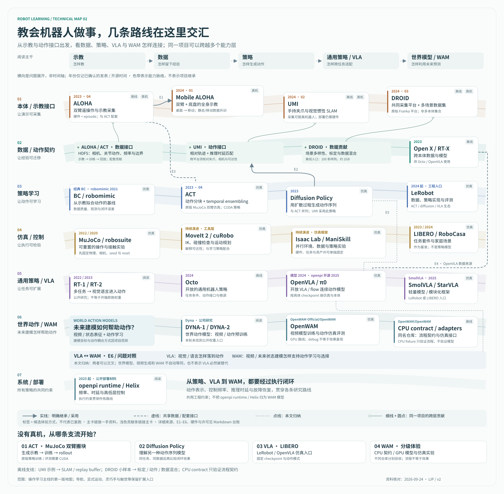

# 机器人研发双视角：共享公开证据与复现台账

Research date: 2026-09-23；示教/策略主线补核：2026-09-24

Scope: 同时服务方案 A 的自驾研发经验迁移与方案 B 的技术地图/公开实践；提供可核对的一手来源。关注团队公开的系统做法、基础库职责和证据边界，不做公司排名或模型效果总榜。

Completion test: 四张外部实践卡各有至少一条官方来源；工具分层中的每个代表项目有官方文档或仓库；每条结论区分来源直接陈述和本文解释。

## 共享使用方式

- [主文档 A：从自驾研发到机器人研发](autonomous-driving-to-robotics-rd-guide.md)：按已有职责、系统差异和研发闭环使用证据。
- [主文档 B：技术地图、公开实践与仿真复现](autonomous-driving-to-robotics-guide.md)：按研究路线、工具生态和复现项目使用证据。
- 两者共享下文的来源、版本、资源门槛、许可证与复现状态；SVG 是共同参考，在 B 中承担领域入口，在 A 中辅助定位研发问题。维护事实时先更新本台账，再检查两篇引用。
- 台账目前更充分覆盖操作学习与公开模型生态。A 的感知、定位、接触、导航和交付专题仍有证据缺口；工程类比标为作者分析，不因引用机器人资料就视为迁移实践已验证。
- 本轮并列的是两种主文档草案，尚未选择、合并或发布；尚未执行机器人基线，不能在任一版本写成“已复现”。

## 结论摘要

- 公开材料更适合回答“某团队公开了怎样的系统切分、数据路线或部署约束”，不够支持“这就是行业最佳实践”。演示、产品页和论文的证明范围必须分开写。
- Google DeepMind、Physical Intelligence、NVIDIA 和 Figure 的公开重点不同：分别可用于观察 VLA/推理、跨本体数据与策略、仿真到部署平台化、以及高低频控制分层。
- cuRobo、MuJoCo、Isaac Sim/Isaac Lab、ROS 2/MoveIt 2、LeRobot/openpi 处在不同层。最小闭环应先选一个仿真环境，再按需接入规划器或模型，不能把它们当成同类替代品。
- awesome 列表能帮助发现论文、模型和 benchmark，但项目是否值得复现要回到官方仓库，检查仿真入口、资源门槛、版本、许可证和评测命令。
- 技术地图以“示教 → 数据 → 策略 → 通用策略/VLA → 世界模型/WAM”为阅读主干；这些是并行发展的能力，不是所有项目必经的升级阶梯。ALOHA/ACT、UMI、DROID 的系统与数据贡献应与模型论文同等可见。

## 示教、本体与策略学习主线

此前以 VLA/WAM 模型为中心的视角低估了“示教怎样变得可采集、可学习、可部署”。本节补齐这些前提。研究影响力、工程入口价值、无真机复现价值分别判断；不因硬件门槛高就从技术地图中删掉系统工作。

**五个关键区分**：ALOHA 是双臂示教平台，ACT 是同篇工作提出的策略方法；Mobile ALOHA 扩展移动操作，并研究静态/移动数据共同训练；UMI 包含手持采集、视觉惯性 SLAM、相对动作表示和时延匹配，不能只概括为 retargeting；DROID 是多机构、多场景采集体系和数据集，原始采集采用共同的 Franka 平台，不能写成“多本体数据集”；LeRobot 是连接数据、算法实现与评测的工程入口，其价值与原创方法贡献分开描述。

### 节点与证据

时间采用论文首次公开的年月；仓库身份是 2026-09-24 的读取快照。此处只完成来源、README、实现片段与许可证检查，没有执行机器人实验。

| node_id / 时间 | 解决的问题 / artifact | 官方来源 | 能证明什么 | 不能证明什么 |
| --- | --- | --- | --- | --- |
| `evo-aloha` / 2023-04 | 降低精细双臂示教门槛；硬件设计、遥操作与 episode 采集系统 | [项目页](https://tonyzhaozh.github.io/aloha/)、[论文 2304.13705](https://arxiv.org/abs/2304.13705)、[硬件代码](https://github.com/tonyzhaozh/aloha) | 公开了 leader/follower 双臂、相机、采集与回放流程；能研究本体和数据如何共同设计 | “低成本”是论文语境，不等于无需硬件；ACT 仿真结果不能证明 ALOHA 真机系统已复现 |
| `evo-act` / 2023-04 | 降低长序列模仿的有效决策时域；Action Chunking with Transformers，含 CVAE、动作块与 temporal ensembling | [同篇论文](https://arxiv.org/abs/2304.13705)、[ACT 代码](https://github.com/tonyzhaozh/act) | 提供双臂 Transfer Cube / Bimanual Insertion 仿真、脚本示教、训练和 rollout 评测入口 | ACT 不是语言条件 VLA；action chunking 不自动消除闭环误差、时延或新场景泛化问题 |
| `evo-mobile-aloha` / 2024-01 | 将桌面双臂示教扩展到移动操作；硬件、全身遥操作、静态/移动数据 co-training | [项目页](https://mobile-aloha.github.io/)、[论文 2401.02117](https://arxiv.org/abs/2401.02117)、[硬件代码](https://github.com/MarkFzp/mobile-aloha)、[学习代码 act-plus-plus](https://github.com/MarkFzp/act-plus-plus) | 官方明确继承 ALOHA/ACT；说明底盘、手臂动作和训练数据需要协同设计 | 运行继承的桌面仿真不等于复现移动操作；论文任务结果不是通用移动机器人能力 |
| `evo-umi` / 2024-02 | 从便携手持示教到机器人执行；采集硬件、SLAM 数据管线、相对轨迹和时延匹配、Diffusion Policy | [项目页](https://umi-gripper.github.io/)、[论文 2402.10329](https://arxiv.org/abs/2402.10329)、[代码/教程](https://github.com/real-stanford/universal_manipulation_interface) | 无机器人也能采集示教；已有公开样例可体验数据处理和训练；论文研究了跨平台部署 | 无机器人采集不等于部署不需要机器人；共享策略仍受夹爪、运动范围、相机和时延条件约束 |
| `evo-droid` / 2024-03 | 在多机构、多场景下规模化收集机器人示教；统一硬件、标定、数据集与策略学习 | [项目页](https://droid-dataset.github.io/)、[论文 2403.12945](https://arxiv.org/abs/2403.12945)、[采集代码](https://github.com/droid-dataset/droid)、[策略代码](https://github.com/droid-dataset/droid_policy_learning)、[数据浏览](https://droid-dataset.github.io/dataset.html) | 共同 Franka 平台上的分布式采集、相机标定和场景多样性可以作为工程研究对象 | 多台机器人不等于多种本体；离线数据训练不能单独证明新本体或真实闭环成功率 |

### 无真机入口与复现门槛

图中使用四种入口标签：**仿真**表示有公开闭环候选；**离线**表示数据处理、训练或接口实验；**真机**表示该系统贡献的完整验证需要硬件；**阅读**表示本轮仅推荐阅读。标签可以并列，都不表示本轮已跑通。复现难度是本文按依赖范围的判断，不是官方 benchmark。

| node_id | 仿真入口 / 无真机体验 | 难度与硬件 | checkpoint / dataset | 许可边界 |
| --- | --- | --- | --- | --- |
| `evo-aloha` | **离线 + 真机**：读 HDF5 episode 和采集代码；配套算法体验转 ACT 仿真 | 离线低，完整硬件高；leader/follower 共四臂、相机、ROS/驱动与通信 | 采集格式与回放脚本；仿真数据由 ACT 仓库提供 | ALOHA 代码 MIT；硬件设计、外部驱动和数据另核对 |
| `evo-act` | **仿真**：官方 `sim_transfer_cube_scripted` / `sim_insertion_scripted`，MuJoCo + dm_control | 中低；原版训练/评测显式调用 `.cuda()`，不能称为 CPU 即跑；仿真可无真机，GPU 显存和时长待实测 | 官方链接提供 scripted/human sim demos；也可脚本生成数据后自行训练，不承诺现成权重 | ACT 代码 MIT；依赖与下载数据分别核对 |
| `evo-mobile-aloha` | **离线 + 真机**：研究公开数据、底盘动作字段与 co-training；未核实等价移动任务的官方仿真入口 | 离线中，完整系统高；双臂、移动底盘、相机与全身遥操作 | 项目页链接数据，学习入口是 `act-plus-plus`，不是只装硬件仓库 | `mobile-aloha` 代码 MIT；学习仓库、数据和硬件资产单独核对 |
| `evo-umi` | **离线 + 真机**：example demo → SLAM → replay buffer → Diffusion Policy；未核实可替代真机评测的官方仿真任务 | 中；Ubuntu 22.04、Docker/SLAM；官方训练示例在 RTX 3090 24GB 验证，非最低显存承诺 | 公开示例视频、processed cup dataset、cup arrangement checkpoint；闭环示例为 UR5/Franka 等真机 | UMI 主仓库 MIT；ORB-SLAM3 分支、硬件设计和数据不得直接沿用 MIT 结论 |
| `evo-droid` | **离线 + 真机**：先浏览少量 episode、核对标定/动作，再读策略学习；本轮未核实官方 simulation evaluator | 离线浏览低，全量数据与训练中高；官方 policy README 的训练使用单张 A100，非最低配置；新采集需 Franka、立体相机与遥操作硬件 | policy-learning README 提供约 2GB / 100 条轨迹的 `droid_100` RLDS 样例和独立 dataloader；全量约 1.7TB，批次/子集须单独固定 | 本轮未定位采集仓库根目录 LICENSE；代码、数据与模型许可待分别核对，不默认宽松开源 |

固定快照（均通过 `git ls-remote` 获取并读取对应提交的 README；MIT 判断来自该提交的 LICENSE）：

| 仓库 | 2026-09-24 提交 | 关键核对位置 |
| --- | --- | --- |
| `tonyzhaozh/aloha` | `06369f03cd8e0a47e16d3a90167853fd33af7557` | README 的 teleoperation、record/replay；LICENSE |
| `tonyzhaozh/act` | `742c753c0d4a5d87076c8f69e5628c79a8cc5488` | README 的 Simulated experiments；`imitate_episodes.py` 的 CUDA 与 50-rollout evaluator；LICENSE |
| `MarkFzp/mobile-aloha` | `0e403249c76054a68e757e590d4da4dba401c9e3` | README 的 ALOHA fork、act-plus-plus 和底盘配置；LICENSE |
| `real-stanford/universal_manipulation_interface` | `d095ba9590df789df5189eea5ee7e431689038a6` | README 的 SLAM、Training Diffusion Policy、Real-world Deployment；LICENSE |
| `droid-dataset/droid` | `33ae6a67274f36d2e29525b86f23a56616ef43a7` | README 的 platform / dataset / policy-learning 分工；根目录 LICENSE / LICENSE.txt 请求未找到文件 |
| `droid-dataset/droid_policy_learning` | `9a29c832b4c81bf38401111f5e4cdddaca217581` | README 的 RLDS、`droid_100` 样例、dataloader 与单 A100 训练；继承 robomimic、Octo 用于数据加载；部署评测需要真实 DROID 控制器 |

### 路线的联系：先固定证据，再画边

| edge_id | 节点关系 | 类型与来源 | 图中允许表达的含义 |
| --- | --- | --- | --- |
| E1 | ALOHA → Mobile ALOHA | **明确继承**：[Mobile ALOHA README](https://github.com/MarkFzp/mobile-aloha/blob/0e403249c76054a68e757e590d4da4dba401c9e3/README.md) 明确说明 fork | 硬件与采集系统扩展；不表示所有移动操作都继承 ALOHA |
| E2 | Diffusion Policy → UMI 策略 | **明确采用**：[UMI README](https://github.com/real-stanford/universal_manipulation_interface/blob/d095ba9590df789df5189eea5ee7e431689038a6/README.md) 的 Training Diffusion Policy | 方法在系统中的采用；UMI 不只是 Diffusion Policy 改名 |
| E3 | ALOHA ↔ ACT | **同工作配套接口**：[ALOHA 项目页](https://tonyzhaozh.github.io/aloha/)分别列硬件系统和学习算法 | 采集与策略共同设计，不声称两个项目先后继承 |
| E4 | Open X → Octo / OpenVLA | **共享训练数据来源**：[Octo](https://octo-models.github.io/)、[OpenVLA](https://openvla.github.io/) | 使用相关数据集合；不声称使用完全相同的数据版本、混合或样本 |
| E5 | ACT / Diffusion Policy ↔ 通用连续动作策略 | **本文归纳**：结合各论文的动作序列与时域问题 | 比较 chunk、表示、推理时延和执行频率；不画成 ACT → Diffusion Policy → π0 的论文血缘 |
| E6 | VLA ↔ WAM | **本文归纳**：结合 VLA 论文与 Dyna/OpenWAM 公开材料 | 对照语言条件、视频/未来状态建模与动作生成；WAM 是探索分支，不是 VLA 必然终点 |

UMI、DROID 不画成 ALOHA 的直接后继；DROID（2024）也不画成 Open X 首发版本（2023）的数据来源。更广泛的数据复用须绑定下游具体版本另查。

### 第一条建议复现：ACT 的仿真闭环

优先从原版 ACT 的 Transfer Cube 开始，或选 LeRobot 的对应 ACT/Aloha 路线；二者实现、依赖和数据转换不同，先各自固定版本，不混用命令和成绩。完整论文复现仍是后续任务。

1. 固定 ACT 提交、Python / MuJoCo / dm_control / PyTorch 与 CUDA；沿用官方环境版本起步，单独记录现代系统兼容性修改。
2. 运行 `record_sim_episodes.py` 的 `sim_transfer_cube_scripted`，生成 50 个 scripted episodes；回放一条，确认图像、双臂关节动作、频率与 episode 边界。
3. 按 README 的 ACT 配置训练，再用相同配置加 `--eval`。固定提交中的 evaluator 默认每个 checkpoint 跑 50 个 rollout，保存视频和成功率；不要把 README 的预期成绩写成本轮结果。
4. 单独改变 chunk size 或 `--temporal_agg`，固定任务与训练数据比较成功数/总数、seed、推理时延与执行平滑性。chunk size 影响训练配置，不能仅换评测参数就声称完成训练消融。
5. 再以 Diffusion Policy + robomimic/robosuite 理解另一种动作序列建模。它与 ACT 默认任务不同，只比较机制；效果比较必须先对齐数据、任务、动作空间、频率和评测。

无 GPU 时先做 episode 浏览/回放；不把原版 ACT `.cuda()` 代码包装成现成 CPU 路线。UMI/DROID 是后续数据工程支线，可无真机做离线体验，但不能用离线 loss 或轨迹回放代替闭环成功率。

## 外部实践卡

| claim_id | 可写入正文的事实 | 一手来源 | 证据等级 | 边界与解释 |
| --- | --- | --- | --- | --- |
| org-gdm-rt2 | RT-2 将视觉语言模型与机器人数据结合，输出用于机器人控制的动作；Google DeepMind 同时报告了仿真和真实世界评测。 | [Google DeepMind: RT-2](https://deepmind.google/blog/rt-2-new-model-translates-vision-and-language-into-action/) | 官方研究文章 | 可说明 VLA 的数据与动作接口问题；不能据此宣称跨本体稳定性或通用交付。 |
| org-gdm-gemini | Gemini Robotics 公开材料把机器人推理、空间理解和动作执行作为具身系统问题来讨论。 | [Google DeepMind: Gemini Robotics](https://deepmind.google/blog/gemini-robotics-brings-ai-into-the-physical-world/) | 官方研究/产品文章 | 公开材料和演示不等于完整训练配方、失败率或安全论证。 |
| org-pi-pi0 | π0 被描述为能接收图像、文本并输出低层电机命令的机器人基础模型，并使用跨机器人数据混合。 | [Physical Intelligence: Our First Generalist Policy](https://www.pi.website/blog/pi0) | 官方研究文章 | 适合讨论 observation/action schema、数据混合和微调入口；任务成绩不能外推到新本体。 |
| org-pi-openpi | openpi 仓库公开了 π0、π0-FAST 等模型和训练/推理代码入口。 | [Physical Intelligence: openpi](https://github.com/Physical-Intelligence/openpi) | 官方开源仓库 | 仓库可复现范围、硬件需求和许可需按具体 commit 核对；不把默认配置写成标准。 |
| org-nvidia-sim | Isaac Sim 被 NVIDIA 定位为用于机器人仿真、测试和合成数据的参考框架，并支持 ROS 2、URDF/MJCF 和软件/硬件在环相关流程。 | [NVIDIA Isaac Sim](https://developer.nvidia.com/isaac/sim) | 官方产品文档 | 说明产品能力和入口；不能作为独立的仿真逼真度或 sim-to-real 证明。 |
| org-nvidia-lab | Isaac Lab 被定位为 GPU 加速、面向 robot learning 的开源仿真框架，覆盖强化学习、模仿学习和运动规划等工作流。 | [NVIDIA Isaac Lab](https://developer.nvidia.com/isaac/lab) | 官方产品文档 | 需记录版本、GPU 和物理引擎；不同任务的训练结果不能互相外推。 |
| org-nvidia-gr00t | Isaac GR00T 的公开定位包含数据管线、机器人基础模型、仿真框架、中间件和推理/控制运行时。 | [NVIDIA Isaac GR00T](https://developer.nvidia.com/isaac/gr00t) | 官方产品文档 | 可作为“平台化组合”的观察案例；产品页不替代独立评测和硬件验证。 |
| org-figure-helix | Figure 公开的 Helix 采用 S2 高层语义过程与 S1 高频低层控制过程，并描述板端 GPU 部署。 | [Figure: Helix](https://www.figure.ai/news/helix) | 官方工程文章 | 可说明异步更新、控制频率和算力预算；内部失败率、数据和泛化范围未公开。 |

## 工具分层

| claim_id | 工具层 | 一手来源 | 版本记录 | 可核对的职责 | 第一版使用边界 |
| --- | --- | --- | --- | --- | --- |
| tool-mujoco | 物理仿真 | [MuJoCo overview](https://mujoco.readthedocs.io/en/stable/overview.html) | stable 文档 + 复核时 commit/tag | 通用物理引擎，面向机器人、接触动力学、控制和机器学习仿真。 | 适合单机、快速、可控的最小闭环；不能直接代表真实接触或渲染差异。 |
| tool-isaac | 高保真/规模化仿真 | [Isaac Sim](https://developer.nvidia.com/isaac/sim), [Isaac Lab](https://developer.nvidia.com/isaac/lab) | 产品页版本 + 仓库 release | 场景、传感器、渲染、物理和 GPU 并行的机器人学习工作流。 | 记录版本和硬件依赖；不要把 Isaac Sim 与 Isaac Lab 写成同一个组件。 |
| tool-curobo | 运动规划/优化 | [cuRobo docs](https://curobo.org/) | cuRoboV2 文档 + 复核时 commit/tag | CUDA 加速的 IK、碰撞检查、轨迹优化、MPC 和高自由度运动生成入口。 | 作为可解释的规划/可达性基线；不能替代 VLA、数据管线或低层安全控制。 |
| tool-ros-moveit | 中间件与操作规划 | [ROS 2 docs](https://docs.ros.org/en/jazzy/index.html), [MoveIt 2 docs](https://moveit.picknik.ai/main/index.html) | ROS 2 Jazzy、MoveIt 文档版本 | ROS 2 提供机器人软件库和工具；MoveIt 2 面向 ROS 2 的操作、运动规划、运动学、感知与控制集成。 | 用于解释执行链和接口契约；最小仿真可不先引入完整 ROS 2 栈。 |
| tool-lerobot | 数据与策略工具 | [LeRobot repository](https://github.com/huggingface/lerobot) | 复核时 commit/tag | Hugging Face 的机器人库入口，覆盖机器人数据/策略实验生态。 | 只记录具体版本、数据集和硬件；不把社区默认流程当行业标准。 |
| tool-openpi | VLA 模型/代码基线 | [openpi repository](https://github.com/Physical-Intelligence/openpi) | 复核时 commit/tag | Physical Intelligence 发布的开放模型与训练/推理代码入口。 | 用于模型 lineage 和 schema 适配检查；先验证运行条件再谈迁移。 |

## Awesome 发现入口

这些仓库用于建立候选池和术语地图。它们是二手索引，不能单独支撑“项目可复现”或“效果领先”的结论；正文引用具体项目时仍回到项目自己的仓库、论文、数据卡和 benchmark 文档。

| claim_id | 索引仓库 | 覆盖范围 | 适合怎么用 | 局限 |
| --- | --- | --- | --- | --- |
| awesome-vla | [Awesome-VLA-Robotics](https://github.com/Jiaaqiliu/Awesome-VLA-Robotics) | VLA 模型、数据集、benchmark、模拟器和相关论文 | 作为 OpenVLA、GR00T、ManiSkill、LIBERO、RoboCasa 等候选的总入口 | 条目数量多，项目维护状态和真实复现难度需要逐项核对 |
| awesome-physical-ai | [Awesome Physical AI](https://github.com/keon/awesome-physical-ai) | Physical AI、VLA、世界模型、benchmark、仿真和公司/工具 | 适合按研究主题补漏，并定位 StarVLA、LeRobot 和仿真环境 | 研究论文、产品链接和项目仓库混在一起，不是验证过的课程路线 |
| awesome-wam | [Awesome World Action Models](https://github.com/HyperbolicCurve/Awesome-World-Action-Model) | WAM/VLA 分类、OpenWAM、模型、benchmark 和基础设施 | 作为 OpenWAM 及世界模型实验的专门发现入口 | 新项目更新快，条目可能先于代码、权重或完整评测公开 |
| awesome-rl-vla | [Awesome RL-VLA](https://github.com/Denghaoyuan123/Awesome-RL-VLA) | offline、online、test-time RL-VLA 论文与代码 | 用于寻找后续强化学习实验，以及检查哪些方法有公开代码 | 论文表格不等于端到端可运行仓库，仿真环境和奖励实现常需另找 |

## 社区文档与工程 Blog

社区文档适合回答“怎样开始、怎样安装和怎样评测”，工程 Blog 适合补充“一个平台如何把仿真、数据和部署串起来”。它们的证据等级低于可复现实验或原始论文，正文应保留版本、硬件和作者口径。

| claim_id | 来源 | 直接支持的事实 | 适合放入阅读路径 | 边界 |
| --- | --- | --- | --- | --- |
| community-lerobot-docs | [LeRobot repository](https://github.com/huggingface/lerobot)、[LIBERO guide](https://github.com/huggingface/lerobot/blob/main/docs/source/libero.mdx)、[EnvHub](https://github.com/huggingface/lerobot/blob/main/docs/source/envhub.mdx)、[robot-learning tutorial](https://huggingface.co/spaces/lerobot/robot-learning-tutorial) | Hugging Face 提供从数据集、policy、仿真环境到 evaluator 的连续入口；LIBERO 文档列出任务 suite、episode 评估和 Wilson interval 的报告方式 | 首个无真机体验；先理解数据、动作模式、回放和评测记录 | 文档中的显存和运行时间是配置估算；不能替代在本机的复跑记录 |
| community-smolvla | [SmolVLA: a small VLA](https://huggingface.co/blog/smolvla) | Hugging Face 介绍面向较低资源的 VLA 路线，并把模型接入 LeRobot 的数据/评测生态 | 作为 Pi0/Pi0.5 之前的轻量模型入口，优先尝试仿真 smoke eval | 博客是作者方介绍；模型质量、速度和显存应以固定版本和任务实测为准 |
| community-mujoco-playground | [MuJoCo Playground](https://github.com/google-deepmind/mujoco_playground) | Google DeepMind 开源了基于 MuJoCo、面向 GPU 加速强化学习和 sim-to-real 研究的任务集合与训练入口 | 用于从单任务控制过渡到并行 RL；可与 LeRobot 的 imitation 路线形成对照 | 需要核对任务、后端、GPU 和许可证；示例成功不等于真实迁移 |
| community-nvidia-gr00t-blog | [GR00T N1](https://developer.nvidia.com/blog/accelerate-generalist-humanoid-robot-development-with-nvidia-isaac-gr00t-n1/)、[Project GR00T](https://developer.nvidia.com/blog/advancing-humanoid-robot-sight-and-skill-development-with-nvidia-project-gr00t/)、[Isaac Lab Arena](https://developer.nvidia.com/blog/simplify-generalist-robot-policy-evaluation-in-simulation-with-nvidia-isaac-lab-arena/) | NVIDIA Blog 展示 Isaac 仿真、合成数据、策略训练和 humanoid policy/evaluation 的产品化路径 | 作为“平台工程”阅读材料，帮助读者理解 Isaac Sim、Isaac Lab、GR00T 和评测工具的关系 | 厂商 Blog 证明产品工作流和示例，不是独立 benchmark；页面中的硬件/版本会变化 |
| community-nvidia-sim2real | [Closing the sim-to-real gap](https://developer.nvidia.com/blog/closing-the-sim-to-real-gap-training-spot-quadruped-locomotion-with-nvidia-isaac-lab/)、[R2D2 with Isaac Lab](https://developer.nvidia.com/blog/r2d2-scaling-multimodal-robot-learning-with-nvidia-isaac-lab/) | 公开案例把域随机化、并行仿真、数据生成和真实部署串为工程流程 | 用来提炼 sim identity、随机化、传感器和部署 proof pack 字段 | 案例任务、机器人和硬件特定，不能外推为所有机器人任务的默认配方 |

## 技术报告与开放模型阅读卡

这些材料值得读，但“值得读”与“值得复现”分开处理。开放代码、公开权重、明确仿真 benchmark 的项目进入复现梯度；只有研究报告或公司自述的项目留在阅读清单。

| claim_id | 来源 | 主要贡献/阅读问题 | 仿真或代码入口 | 推荐级别与边界 |
| --- | --- | --- | --- | --- |
| report-open-x | [Open X-Embodiment / RT-X](https://robotics-transformer-x.github.io/) | 跨本体数据集、共同数据格式和 RT-X 模型；适合研究 dataset lineage、动作空间和跨 embodiment 评估 | 数据与模型页面、相关开源实现；可结合 LIBERO/LeRobot 评测 | 高信号阅读；先复现下游 checkpoint/eval，不把数据规模直接等同于泛化 |
| report-octo | [Octo](https://octo-models.github.io/) | 开放通用机器人 policy、finetuning 和多任务接口 | 官方模型/代码入口，可接仿真或离线数据；需按 README 核对环境 | 中高：适合理解 policy conditioning；完整训练资源和真实任务结果不宜低估 |
| report-diffusion-policy | [Diffusion Policy](https://diffusion-policy.cs.columbia.edu/) | 用扩散模型做 visuomotor policy，并报告多个 manipulation benchmark | 官方代码与 robomimic/robosuite 生态可形成 MuJoCo 复现路线 | 高：适合与 BC、VLA 做方法对照；需锁定数据、控制频率和相机设置 |
| report-openvla | [OpenVLA](https://openvla.github.io/)、[LIBERO evaluation](https://github.com/openvla/openvla#libero-simulation-benchmark-evaluations) | 开放 VLA、微调和 LIBERO 仿真评测 | 官方 LIBERO evaluator、公开 checkpoint；固定 commit 后运行单 suite 或 500-trial benchmark | 高：论文级仿真基线；A100、FlashAttention、checkpoint 许可和多 seed 是复现前置条件 |
| report-openpi | [Physical Intelligence openpi](https://github.com/Physical-Intelligence/openpi) | π0/π0-FAST 的开放训练和推理代码、action/observation schema 适配入口 | 官方仓库和示例配置；可接 LeRobot/LIBERO 等下游路线 | 中高：适合读 schema、微调和部署边界；不要把仓库可运行等同于公开 π0 全部训练配方 |
| report-dyna | **DYNA-1 / DYNA-2（Dyna）**：[Dyna research](https://www.dyna.co/research)、[DYNA-1](https://www.dyna.co/research/dyna-1)、[pre-training](https://www.dyna.co/research/pre-training)、[DYNA-2](https://www.dyna.co/dyna-2)、[DYNA-2 infrastructure](https://www.dyna.co/research/dyna-2-infrastructure)、[customer deployments](https://www.dyna.co/research/scaling-customer-deployments)、[open-world dexterity](https://www.dyna.co/research/open-world-dexterity) | 世界动作模型、视频/动作预训练、跨本体数据、million-hour scaling 和从模型到产品部署的公司研究叙事 | 未发现适合普通读者直接运行的官方仿真仓库或公开 checkpoint；保留为阅读卡 | 高信号技术阅读，低可复现性；scaling law、生产指标和 live demo 不能当作独立 benchmark |

## 顶会奖项视角

Best Paper / finalist 是压缩阅读范围的高信号入口，但奖项不是行业最佳实践证明。筛选时额外检查官方代码、仿真 benchmark、公开数据/权重和资源门槛；没有这些材料的论文只进入阅读清单。

| claim_id | 会议官方入口 | 代表论文 | 可复现性判断 | 推荐处理 |
| --- | --- | --- | --- | --- |
| award-icra24 | [ICRA 2024 Awards and Finalists](https://2024.ieee-icra.org/awards-and-finalists/) | `Open X-Embodiment: Robotic Learning Datasets and RT-X`、`SARA-RT`、`TinyMPC`、`VLFM`、`Learning to Walk in Confined Spaces Using 3D Representation` | 论文信号强；Open X-Embodiment 有数据/模型入口，TinyMPC/VLFM 等需分别核对代码与任务环境 | 作为数据、控制、导航和 locomotion 的专题阅读入口；仅把有固定仿真命令的条目放入复现梯度 |
| award-corl24 | [CoRL 2024 Awards](https://2024.corl.org/program/awards/) | winners：`PoliFormer`、`One Model to Drift Them All`；finalists：`ReMix`、`Equivariant Diffusion Policy`、`HumanPlus`、`OpenVLA` | OpenVLA、Equivariant Diffusion Policy 等有公开代码/仿真生态；其他项目要单独核对 checkpoint 和环境 | OpenVLA + LIBERO、Diffusion Policy + robosuite 优先复现；其余作为论文阅读或后续专题 |
| award-corl25 | [CoRL 2025 Awards](https://2025.corl.org/program/awards/) | best paper：`Learning a Unified Policy for Position and Force Control in Legged Loco-Manipulation`、`Fabrica`；finalists：`LocoFormer`、`Visual Imitation Enables Contextual Humanoid Control`、`DexUMI`、`The Sound of Simulation`、`Pi 0.5`、`Steering Your Diffusion Policy with Latent Space Reinforcement Learning` | 论文新、复现资料成熟度差异大；Pi 0.5/OpenVLA 生态和部分仿真工作较容易进入代码核验，真机/硬件特定工作门槛高 | 先读摘要、代码和 supplementary，再决定是否纳入路线；不以 finalist 身份替代运行证据 |

### 奖项论文的复现闸门

每个候选在进入“值得做”列表前记录：官方代码 URL 和 commit、仿真环境/任务、公开 checkpoint 或数据、显存/硬件、评测命令、许可证、预期产物，以及“能证明什么/不能证明什么”。满足前三项但缺少可运行命令的，标为“可读、待验证”；只有完成固定 smoke eval 后才标为“可复现”。

## 技术地图草案：两张互补视图

Markdown 是节点、关系和证据的主记录；浅色 SVG 河流 v2 是当前展示方案，旧图保留为对比草案。暂不制作 HTML deck。两张内容视图共享节点，但回答不同问题：

1. **领域全景图**：按能力分支组织，说明本体/示教、控制、数据、策略、模型、仿真和部署之间的并行关系。
2. **VLA/WAM 演进图**：按研究问题的转折组织，以“示教 → 数据 → 策略 → 通用策略/VLA → 世界模型/WAM”为阅读主干，说明问题怎样交汇；此顺序不代表严格年代、唯一因果或全面替代。

### 视图 A：领域全景图

| 分支 | 需要回答的问题 | 代表节点 | 与其他分支的关系 |
| --- | --- | --- | --- |
| 本体与示教接口 | 人怎样演示，演示怎样转成可执行轨迹 | ALOHA、Mobile ALOHA、UMI、DROID 采集平台 | 与数据、动作表示、策略和部署共同设计；无机器人采集不等于无机器人验证 |
| 控制与规划 | 动作是否可达、稳定、满足约束 | MuJoCo control、cuRobo、MoveIt 2、TinyMPC | 为策略提供可执行边界；失败不能归咎于模型而跳过可达性检查 |
| 操作策略 | 如何从观测和示教生成动作序列 | BC、robomimic、Diffusion Policy、ACT | 消耗数据契约和仿真环境；输出必须进入控制/执行链 |
| 数据与基准 | 不同任务和本体如何共享 episode、action 和评测 | ALOHA episodes、UMI replay buffer、DROID、Open X-Embodiment、LIBERO、LeRobot | 决定模型能否比较；数据规模不能替代 schema 和任务口径 |
| 通用机器人模型 | 如何把视觉、语言和动作放进可适配 policy | RT-1、RT-2、Octo、OpenVLA、π0、SmolVLA | 依赖跨本体数据和 action schema；仿真 checkpoint 是复现入口 |
| 语言与任务规划 | 自然语言如何变成可验证的子任务或技能调用 | SayCan、Code as Policies、VLM/VLA task planning | 需要调用策略、规划器和执行器；语言合理不等于动作可执行 |
| 仿真与数据基础设施 | 如何低成本产生轨迹、传感器和并行 rollout | MuJoCo、Isaac Sim/Lab、ManiSkill、RoboCasa、RoboVerse | 提供训练和评测环境；不能单独证明 sim-to-real |
| 世界模型 / WAM | 如何预测行动后果并在世界层面生成动作 | DYNA-1、DYNA-2、OpenWAM、world-action models | 连接视频预训练、动作预测和跨本体数据；公开可复现性差异很大 |
| 系统与部署 | 如何把模型变成有延迟、资源和安全边界的运行时 | openpi runtime、Isaac GR00T、Figure Helix、ROS 2 | 约束模型的频率、算力和故障处理；产品 Blog 不是独立 benchmark |

### 视图 B：VLA / WAM 演进图

表格按阅读问题展开：2023–2024 年的示教系统与 RT/VLA 路线并行发展，不能把行序当成历史先后。图中宽色河带仅表示能力脉络；细实箭头表示来源确认的继承/采用，虚线表示共享数据或配套接口，点线表示本文归纳。具体项目关系见 E1–E6。

| 阶段 | 新增问题 | 代表节点 | 留下的接口问题 | 关系类型候选 |
| --- | --- | --- | --- | --- |
| 示教成为数据 | 能否低门槛收集高质量双臂示教 | ALOHA（2023） | 本体、相机、同步和 episode 格式 | 与 ACT 同工作配套，E3 |
| 从一步到动作块 | 怎样减少长时域模仿误差、表达动作序列 | BC、ACT（2023）、Diffusion Policy（2023） | chunk、temporal ensembling、重规划频率与延迟 | 方法对照是本文归纳，E5 |
| 移动操作 | 桌面技能如何扩展到底盘与双臂协同 | Mobile ALOHA（2024） | 底盘/手臂动作、静态与移动数据 co-training | ALOHA 明确扩展，E1 |
| 示教与目标机器人解耦 | 手持采集怎样映射到机器人执行 | UMI（2024） | SLAM、相对轨迹、跨平台接口和时延匹配 | 采用 Diffusion Policy，E2 |
| 采集规模化 | 多机构、多场景如何收集一致数据 | DROID（2024） | 共同硬件、相机标定、数据质量与场景分布 | 分布式采集；不等于跨本体 |
| 单任务闭环 | 能否在固定环境中重复学习和评测动作 | MuJoCo、robomimic、ACT 仿真、Diffusion Policy | 数据、控制周期、相机和 reset 是否固定 | 共享仿真 / 方法对照 |
| 多任务 policy | 一个 policy 如何覆盖多个任务和视觉条件 | RT-1、Octo | task conditioning、动作表示和任务分布如何定义 | 明确继承 |
| 跨本体数据 | 不同机器人能否共享经验 | Open X-Embodiment / RT-X | embodiment、坐标、动作空间和数据 lineage | 共享数据 |
| 语言进入动作 | web/vision-language 知识如何落到机器人动作 | RT-2 | token/action interface、长时规划与执行约束 | 明确继承 / 本文归纳 |
| 开放 VLA | 社区如何复现、微调和比较 VLA | OpenVLA、StarVLA、LIBERO | checkpoint、评测 suite、GPU 和许可证 | 共享 benchmark |
| Flow / continuous action | 如何更直接地生成连续动作 chunk | π0、openpi、Pi 0.5 | action horizon、推理延迟、本体适配 | 明确继承 / 本文归纳 |
| 低资源 VLA | 没有大 GPU 时怎样体验和验证 VLA | SmolVLA、LeRobot | 资源估算和 smoke eval 能否复核 | 社区实现 |
| 世界动作模型 | 视频、动作和未来状态能否共同扩展 | DYNA-1、DYNA-2、OpenWAM | 训练数据、环境交互、仿真 adapter 和产品部署 | 公司研究 / 开放基础设施 |

### 地图节点的最小字段

每个节点先用下面字段写在台账里，再考虑画图：

| 字段 | 说明 |
| --- | --- |
| `node_id` | 稳定标识，例如 `evo-openvla` |
| `time` | 已确认的论文、开源或产品公开时间；图中缺少可靠来源时省略，不拿核对日期代替 |
| `checked_at` | 本条来源最近核对时间，只进入台账与图脚，不进入项目年份栏 |
| `display_name` / `owner` | 节点用具体方法、模型、系统或工具名；公司/机构单独作为归属信息 |
| `problem` | 它试图解决的具体问题 |
| `artifact` | 论文、仓库、数据集、工具或产品 |
| `relation` | 与其他节点是继承、共享数据/基准，还是本文归纳 |
| `sim_entry` | 是否有公开仿真任务、checkpoint 或 smoke eval |
| `evidence_level` | 论文、官方仓库、产品 Blog、社区索引或已复跑实验 |
| `boundary` | 能证明什么、不能证明什么 |

当前主展示是 [演进河流 v2](autonomous-driving-to-robotics-map-river-v2.svg)：七条并行能力河道、项目跨层映射、来源关系与无真机入口。横向位置是问题展开；卡片仅写已确认的发表/开源年份，缺少可靠来源则省略，不把稀疏节点拉成精确年代轴。



旧版仅保留为信息结构对比，不继续作为完整事实地图：

- [双视图总览](autonomous-driving-to-robotics-map-demo.svg)：上半区是领域分支，下半区是 VLA/WAM 演进线，适合做总览封面。
- [能力矩阵](autonomous-driving-to-robotics-map-matrix-demo.svg)：项目可以同时占据数据、策略、仿真和运行时多个单元，适合回答“一个项目到底覆盖哪些能力”。
- [演进河流](autonomous-driving-to-robotics-map-river-demo.svg)：项目卡沿时间和问题转折移动，下方再补数据、控制、仿真和运行时支流，适合同时回答“下一代方法接住了哪个未解决的问题”和“它依赖哪些能力”。

v2 优先覆盖本轮讨论的操作学习路线；导航、足式运动、灵巧手、触觉、任务规划等仍是领域全景的后续扩展，不把此图称为机器人领域全集。旧图尚未同步新增节点，尤其不能使用旧图的横坐标推断项目首发年份。

图是可缩放的大图：桌面可滚动阅读，手机建议打开 SVG 后放大；当前没有制作移动端重排或 HTML deck。

颜色表示能力河道。**同一项目保留一张主卡，跨层信息使用简短贡献条**，以相同 `node_id` 和细线/圆点关联；贡献条不是另一项工作，也不表示项目先后继承。UMI 的主卡保留手持采集与 SLAM，数据河道保留相对轨迹和时延匹配；DROID 的主卡同时说明共同采集平台与数据集，数据河道补充场景、标定和样例入口；ALOHA/ACT 的 episode 信息也改为配套贡献条。详细切分继续保留在本台账的节点表中。

主卡点击进入一手资料，贡献条点击回到图内主卡；SVG 中的 `<title>` 保留标识与边界。带箭头实线仍表示明确继承/采用，虚线表示共享数据/配套接口，点线表示本文归纳；同项目的细线/圆点不新增技术血缘。

**WAM 保持独立技术路线**：图中第六条河道明确标为“世界动作 / WAM”，与第七条“系统 / 部署”分开。它保留三个层次：研究问题（视频/未来状态建模怎样支持动作学习与选择）、模型或模型实验（DYNA-1 / DYNA-2、`OpenWAM-Official/OpenWAM`）、基础设施契约（`OpenWAM/OpenWAM` 的 CPU fixture / adapters）。后两条同名 GitHub 路径各有独立卡片及 `project_id`，沿用下文固定提交；不是把同一个项目重复展示。

E6 在图中连接 VLA 与 WAM 的问题对照：视觉/语言条件下生成动作，与预测/表征学习如何参与动作学习和选择可以交叉，属于本文归纳。不能仅凭“视频生成”或“世界模型”标签判定一个项目是 WAM，也不声称各个 WAM 使用同一训练目标。DYNA 的公司报告只能支持作者公开的研究方向；OpenWAM 的 debug lifecycle 与 CPU contract 都不能代替模型闭环效果验证。底部体验入口同时保留 ACT、Diffusion Policy、VLA 与 WAM，防止无真机路线只剩 VLA。

**模型身份与公开状态**：图中使用 `DYNA-1 / DYNA-2`，归属小字为 `Dyna · 公司研究`；入口为“阅读”，并注明“本轮未找到公开权重入口”。保留 `report-dyna` 作为这一组阅读资料的稳定标识，不把公司当作模型，也不为视觉平衡额外增加公司。报告能支持研究方向和作者声明，不能与开放代码、权重、仿真评测的证据等同。

**时间规则**：资料核对日期在图脚统一注明，本台账的逐条日期/快照仍保留。DYNA-1/2、StarVLA、OpenWAM 首发年份尚未在本台账确认，卡片省略这些年份；SmolVLA 已确认的 2025 年单独署名。删去卡片中的“核对*”与对应星号注释，不通过本次视觉修改推断发布日期。

详细版本、许可证、资源门槛以本台账为准。所有入口标签都是候选状态，本轮未执行策略实验。

### 时间线节点的证据边界

| milestone_id | 时间线节点 | 一手来源 | 适合说明什么 | 不应外推什么 |
| --- | --- | --- | --- | --- |
| evo-mujoco | MuJoCo（2012 IROS 论文） | [MuJoCo IROS 2012](https://doi.org/10.1109/IROS.2012.6386109)、[overview](https://mujoco.readthedocs.io/en/stable/overview.html) | 可重置的物理、接触和控制实验底座 | 真实接触和 sim-to-real 等价性 |
| evo-qtopt | QT-Opt（2018） | [QT-Opt: Scalable Deep Reinforcement Learning for Vision-Based Robotic Manipulation](https://arxiv.org/abs/1806.10293) | 大规模抓取数据与闭环视觉控制的研究路线 | 普通读者可复现同等硬件、数据和在线试错规模 |
| evo-robomimic | robomimic（2021） | [robomimic 论文](https://arxiv.org/abs/2108.03298)、[仓库](https://github.com/ARISE-Initiative/robomimic) | demonstration dataset、BC 和 policy baseline 的统一实验入口 | VLA 语言泛化或跨本体能力 |
| evo-aloha / evo-act | ALOHA / ACT（2023-04） | [项目页](https://tonyzhaozh.github.io/aloha/)、[论文](https://arxiv.org/abs/2304.13705) | 示教硬件与 action chunking 策略共同设计；详见前述节点表 | 不能混同硬件复现与 ACT 仿真 |
| evo-mobile-aloha | Mobile ALOHA（2024-01） | [项目页](https://mobile-aloha.github.io/) | 移动双臂示教与 co-training | 桌面仿真等于移动操作复现 |
| evo-umi | UMI（2024-02） | [项目页](https://umi-gripper.github.io/) | 手持采集、相对动作、SLAM 和时延匹配 | 离线训练等于跨本体部署验证 |
| evo-droid | DROID（2024-03） | [项目页](https://droid-dataset.github.io/) | 共同平台上的分布式、多场景采集 | 同一平台的多台机器人等于多种本体 |
| evo-diffusion | Diffusion Policy（2023） | [Diffusion Policy](https://diffusion-policy.cs.columbia.edu/) | 动作序列扩散建模和 visuomotor imitation 基线 | 开放世界、跨本体和真机长期稳定性 |
| evo-rt1 | RT-1（2022） | [Robotics Transformer 1](https://robotics-transformer1.github.io/) | 多任务 robot policy 的 Transformer 接口 | 任意机器人本体零样本执行 |
| evo-openx | Open X-Embodiment / RT-X（2023） | [RT-X project](https://robotics-transformer-x.github.io/) | 跨本体数据集、统一格式和共享动作接口 | 数据规模直接带来通用泛化 |
| evo-rt2 | RT-2（2023） | [Google DeepMind RT-2](https://deepmind.google/blog/rt-2-new-model-translates-vision-and-language-into-action/) | web/robot 数据混合和 vision-language-action 研究接口 | 长时真机交付和完整安全边界 |
| evo-openvla | OpenVLA（2024） | [OpenVLA](https://openvla.github.io/)、[LIBERO evaluation](https://github.com/openvla/openvla#libero-simulation-benchmark-evaluations) | 开放 VLA、checkpoint 和 LIBERO 仿真评测 | 低显存迁移和新本体自动适配 |
| evo-pi0 | π0（2024）；openpi 开源（2025） | [Physical Intelligence openpi](https://github.com/Physical-Intelligence/openpi) | flow-based action model、schema 和开放训练/推理入口 | 开放仓库覆盖全部生产训练配方 |
| evo-isaac | Isaac Lab（2024） | [NVIDIA Isaac Lab](https://developer.nvidia.com/isaac/lab) | GPU 并行仿真、策略训练和 sim-to-real 工程入口 | 不同任务共享同一套物理和迁移结论 |
| evo-smolvla | SmolVLA（2025） | [Hugging Face SmolVLA](https://huggingface.co/blog/smolvla) | 低资源 VLA 的社区体验入口 | 博客资源估算替代本机复跑 |
| proj-openwam-official / proj-openwam-cpu（原组标识 evo-openwam） | OpenWAM 两个仓库（首发年份待核；来源核对时间见项目快照） | [OpenWAM/OpenWAM](https://github.com/OpenWAM/OpenWAM)、[OpenWAM-Official/OpenWAM](https://github.com/OpenWAM-Official/OpenWAM) | WAM 基础设施、benchmark adapter 和部署链路的公开方向 | CPU synthetic contract 等于 WAM 模型效果 |

## 可复现项目梯度

排序依据是“没有真机时能否得到有意义的仿真结果”，同时考虑安装复杂度、公开权重/数据、评测命令、计算资源和许可证。这里的“推荐”是复现顺序，不是模型效果排名。

### OpenWAM 名称核对

GitHub 上存在两个同名但不能混写的路径：`OpenWAM/OpenWAM` 提供 AGPL-3.0 的 CPU-first 合同测试、合成 fixture 和 simulator adapter；`OpenWAM-Official/OpenWAM` 是 Apache-2.0 的另一条公开 WAM 基础设施路线，完整 Wan2.2-TI2V-5B 训练建议 8×80GB GPU。本台账把前者列为低门槛基础设施复现，把后者列为高级模型/benchmark 路线。

| project_id | 项目与固定提交（2026-09-22 核对） | 仿真入口 | 无真机门槛 | 许可证 | 建议复现目标 | 主要风险/边界 |
| --- | --- | --- | --- | --- | --- | --- |
| proj-act-sim | [ACT](https://github.com/tonyzhaozh/act) @ `742c753c0d4a5d87076c8f69e5628c79a8cc5488`（2026-09-24 补核） | 官方 MuJoCo + dm_control：Transfer Cube / Bimanual Insertion | 中低：无需真机；原版策略训练和评测依赖 CUDA，显存/时长待实测 | MIT 代码；依赖与数据另核对 | 50 条脚本示教 → ACT 训练 → 50-rollout evaluator；记录视频、成功数/总数，再研究 chunk 与 temporal ensembling | 旧 Python/仿真依赖需固定；仅完成源码检查，尚未跑实验；不能证明 ALOHA 硬件或语言泛化 |
| proj-lerobot-pusht | [LeRobot](https://github.com/huggingface/lerobot) @ `240ea44cf9f887df944019cf46e18a0d496e1a56` | `lerobot[aloha]` / `lerobot[pusht]`；另有 LIBERO、MetaWorld evaluator | 低：Pusht/Aloha 先做，CPU 可跑部分流程；训练资源随 policy 变化 | Apache-2.0 | 先跑数据集读取、ACT/扩散策略训练与回放，再跑 `lerobot-eval` 的 LIBERO 小样本 | 仿真环境和 policy 需要额外 extras；Pi0/Pi0.5 约 24–40GB VRAM，不能把轻量 policy 经验外推到大 VLA |
| proj-lerobot-libero | 同上，使用 [LeRobot LIBERO guide](https://github.com/huggingface/lerobot/blob/main/docs/source/libero.mdx) | MuJoCo LIBERO：130 tasks、四个标准 suite，可固定 episode 和 Wilson 区间 | 中低：无真机；Linux + MuJoCo，预训练 checkpoint 省去训练成本 | Apache-2.0（LIBERO 数据集另按其许可） | 用 `lerobot/pi05_libero_finetuned` 或 SmolVLA 做 3–10 episode smoke eval，再扩大到 10 episodes/task | 不同 checkpoint 的 absolute/relative action mode 必须匹配；小样本只能做冒烟验证，不能写成 benchmark 结论 |
| proj-openvla-libero | [OpenVLA](https://github.com/openvla/openvla) @ `c8f03f48af692657d3060c19588038c7220e9af9` | 官方 LIBERO simulation evaluation，四 suites、默认 500 trials | 中：无真机，但官方复现实验建议 A100，OpenVLA 7B 和 FlashAttention 安装较重 | MIT 代码；预训练权重受底座模型条款约束 | 复现一个官方 LoRA checkpoint 的 LIBERO suite，记录 GPU、seed、500 trials 和结果日志 | 官方结果在 A100、固定软件版本和多个 seed 上报告；模型权重许可还受底座模型条款影响 |
| proj-starvla-libero | [StarVLA](https://github.com/starVLA/starVLA) stable `starVLA` @ `3422b9f2387b6f682cf02802904a77b23ab13afd` | 官方 Quick Start 的 LIBERO pipeline；同时支持 LIBERO-plus、SimplerEnv、RoboCasa、RoboTwin、RoboDojo 等 | 中高：无真机，仓库称较小 VLM 可单张 A100；完整训练和多 benchmark 会迅速增大 | MIT | 先按 stable `starVLA` 分支跑 LIBERO 的安装、checkpoint 加载和单 suite eval，再研究可插拔 action head | `starVLA_dev` 是活跃开发分支，不能拿默认 HEAD 代替稳定提交；README 的 SOTA/本地快照是项目方口径，需保留任务、checkpoint 和分母，不直接当行业结论 |
| proj-robomimic-robosuite | [robomimic](https://github.com/ARISE-Initiative/robomimic) @ `d309eaecc18acf4152a830a895a6984b8ac71b05` + [robosuite](https://github.com/ARISE-Initiative/robosuite) @ `5ce6643f3092639d08f7b0f90ed1c6a84f50552c` | MuJoCo manipulation tasks、demonstration datasets、BC/Diffusion/Offline RL；robomimic 提供 Colab 和 CPU Docker | 低：完全仿真，先做低维或视觉 imitation learning | MIT（分别按仓库 LICENSE 核对） | 用 Lift/Can/Tool Hang 等单任务比较 BC、BC-RNN、Diffusion Policy，并保存 rollout 视频和 success 条件 | 这是经典机器人学习基线，不等于 VLA；数据、相机、控制频率和 robosuite 版本必须锁定 |
| proj-maniskill | [ManiSkill](https://github.com/haosulab/ManiSkill) @ `62ff3a5896b4d5b4cf0ac4c8d79afe600c9404a3` | SAPIEN GPU-parallel simulation；官方提供 Quick Start 和 Colab notebook | 低到中：官方称 quickstart 可在 Colab free tier 运行；高吞吐 GPU 训练需 Linux/NVIDIA | Apache-2.0 级代码/环境；资产 CC BY-NC 4.0 | 先跑单环境任务，再比较并行采样、RGBD/segmentation 数据和一项 imitation/RL baseline | Linux/NVIDIA 对 GPU sim 最友好；资产有 CC BY-NC 4.0 约束，不能只看代码许可证 |
| proj-openwam-cpu | [OpenWAM/OpenWAM](https://github.com/OpenWAM/OpenWAM) @ `81f9695beaba868ebf1868bc3f33c3d6e0e31da6` | public tiny synthetic contract；官方 quickstart 提供完整 CPU train → eval → rollout lifecycle；另有 LIBERO/RoboTwin/CALVIN adapters | 低：CPU lifecycle 不需要私有数据、checkpoint、GPU 或外部 simulator；真实 benchmark 另需数据和 simulator | AGPL-3.0（第三方组件另见 notices） | 首先跑 CPU synthetic contract，验证 train/resume/eval/simulator boundary 和 reproducibility JSON；再安装 LIBERO 做 policy rollout | synthetic fixture 只证明基础设施契约，不证明 WAM 策略效果；AGPL 和第三方许可证必须单独核对 |
| proj-openwam-official | [OpenWAM-Official/OpenWAM](https://github.com/OpenWAM-Official/OpenWAM) @ `90e94ae31efddd64b59e00365cfc501d9a972eb1` | LIBERO、LIBERO-plus、RoboTwin、RoboCasa、VLABench 等 benchmark client；`training.debug=true` 的 20-step lifecycle | 高：无真机，但完整 Wan2.2-TI2V-5B 训练推荐 8×80GB；需 CUDA 12.8/编译依赖 | Apache-2.0 | 先做 debug train → deploy → single/continuous inference，之后再考虑 LIBERO checkpoint eval | 与 `OpenWAM/OpenWAM` 是两个 GitHub 路径，不能混写；debug lifecycle 只证明安装、checkpoint、server 和 schema 链路 |
| proj-robocasa | [RoboCasa](https://github.com/robocasa/robocasa) @ `4f8a2980def75a55dff96b990745b83540425f09` | MuJoCo household/kitchen simulation；RoboCasa365 有 365 tasks、2500+ kitchen scenes | 中高：无真机，但首次资产下载约 10GB，环境与数据规模较大 | MIT 代码；资产/数据 CC BY 4.0 | 作为第二阶段 household manipulation benchmark，先跑一个 task 和官方 demo，再接 policy eval | 资产和数据需单独核对许可证；大规模任务不适合作为第一条入门路线 |
| proj-roboverse | [RoboVerse](https://github.com/RoboVerseOrg/RoboVerse) @ `5f3ec0185d2d3bcb59d53b0bd1f5b0f8a6f2ce14` | MetaSim 统一仿真核心，集成 MuJoCo、Isaac、SAPIEN、ManiSkill、robosuite 等 | 高：无真机，但多 simulator、assets 和 integration 使安装面很大 | Apache-2.0 核心；集成组件按上游许可证 | 作为跨仿真接口和统一 benchmark 的第二阶段项目，不作为首个学习项目 | 组件各有上游许可证；统一 API 不代表不同物理后端结果可直接比较 |

### 推荐顺序

1. **首个方法闭环**：ACT + 官方 MuJoCo Transfer Cube；也可选 LeRobot + ACT/Aloha。先理解示教、action chunk、rollout 与成功条件。最轻量的环境/数据体验可从 LeRobot + PushT 开始。
2. **无 GPU 的系统体验**：`OpenWAM/OpenWAM` public tiny synthetic contract，先理解 train/resume/eval/simulator boundary 和 reproducibility JSON。
3. **标准 VLA 仿真**：LeRobot + LIBERO；硬件不足时直接使用公开 checkpoint 做小样本 smoke eval。
4. **论文级基线**：OpenVLA + LIBERO，或者 StarVLA + LIBERO；固定软件版本和 GPU 后再跑完整 suite。
5. **经典方法与数据支线**：Diffusion Policy / robomimic + robosuite；UMI / DROID 的离线数据体验。先区分仿真闭环、离线训练和真机部署，再讨论方法差异。
6. **高级研究线**：`OpenWAM-Official/OpenWAM` debug lifecycle、ManiSkill 并行训练、RoboCasa/RoboVerse；先记录资源和依赖，不承诺一次跑通完整结果。

### 最小命令锚点

这些命令来自项目自己的 quickstart 或 evaluator 文档，适合正文后续改写成逐步复现卡。它们只证明“能启动并产出可检查的结果”，不自动证明模型效果。

```bash
# OpenWAM/OpenWAM：CPU synthetic contract，不需要 GPU、私有 checkpoint 或外部 simulator
uv run openwam-validate-config \
  configs/examples/public_tiny_synthetic_contract.yaml \
  configs/evals/public_tiny_synthetic_contract.yaml

RUN_ROOT="runs/public-tiny-$(date +%Y%m%d-%H%M%S)"
uv run --extra train openwam-train \
  --cfg configs/examples/public_tiny_synthetic_contract.yaml \
  --save-root "$RUN_ROOT" --expected-world-size 1 --disable-wandb

uv run --extra eval openwam-eval \
  --cfg configs/evals/public_tiny_synthetic_contract.yaml \
  --checkpoint "$RUN_ROOT/checkpoints/checkpoint_step_1/model_state.pt" \
  --device cpu --max-batches 1
```

```bash
# LeRobot：先用公开 checkpoint 做 LIBERO 小样本仿真 smoke eval
lerobot-eval \
  --policy.path="your-policy-id" \
  --env.type=libero \
  --env.task=libero_object \
  --eval.batch_size=2 \
  --eval.n_episodes=3
```

OpenVLA 的 [LIBERO evaluation guide](https://github.com/openvla/openvla#libero-simulation-benchmark-evaluations) 和 StarVLA 的 [LIBERO Quick Start](https://github.com/starVLA/starVLA/blob/master/docs/starVLA_guideline.md) 保留各自的安装、checkpoint 和版本前置条件；不在本台账复制容易过期的完整 shell 脚本。

## 复现基线候选

首选一个能够在单机完成的操作任务，优先级按“命令清晰、环境身份可固定、结果可验收”排序：

1. **MuJoCo + 简单机械臂任务**：先验证 observation/action、控制周期、seed、成功条件和回放。
2. **Isaac Lab + 同类任务**：在有合适 GPU 时验证并行环境、渲染/传感器和训练配置的影响。
3. **cuRobo 规划基线**：对同一目标提供可解释的 IK/碰撞/轨迹结果，用来区分策略失败与动作不可达。

首轮不做跨环境效果排名。只有在任务、机器人、控制周期、随机化、指标和版本都对齐时，才比较迁移结果。

## 不确定性与缺口

- 公司公开文章通常强调能力和演示，训练数据细节、失败样本、长期稳定性、安全边界和硬件维护成本常常缺失。
- 产品页是产品能力的一手来源，但不是独立基准；博客中的成功率必须连同任务集、分母、环境和评测方法一起引用。
- 2026 年模型、仓库和仿真工具仍在快速变化。正文写作时重新核对页面、仓库 commit/tag、许可证和硬件要求；本台账不冻结未来版本。
- ACT、UMI、DROID、LeRobot、openpi、Isaac 和 cuRobo 的具体复现命令尚未在本轮运行，当前只记录候选入口，不写成“已复现”。

## Method

按“官方产品/博客 → 官方文档/仓库 → 原始论文”的顺序核对，先定义团队卡和工具层字段，再收集来源。搜索结果和社区文章仅用于发现线索；本台账只把能定位到一手 URL 的材料纳入正文候选。研究范围不包含公司排名、采购建议、完整 VLA 综述和未公开的内部实践。
