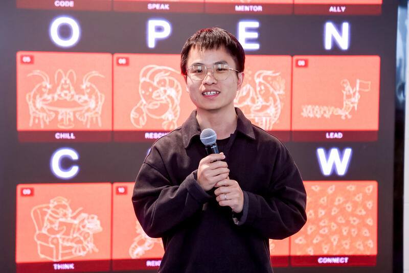

## 我是谁

**缪东旭（MiaoDX）**，目前在北京，长期在工程一线做 AI 与自动驾驶相关系统，正在把个人实践升级为新 OPC：「One Person + multi Claws」  
我希望把做事过程透明化，让更多人看到：AI Agent 不只是 demo，而是能真实创造交付价值的生产系统

## 学习与工作经历

- 2025-：Robotics Team @ XiaomiEV
- 2021-2025：Perception-System TeamLead @ XiaomiEV
- 2019-2021：DeepMotion.ai
- 2018：horizon.ai
- 2016-2018：TJU
- 2012-2016：xidian

## 两大内容主线

### [Part A — AI Coding](/ai-coding)

- 用 AI 辅助编程的真实实践，正在积累中
- 目前案例集中在 OpenClaw 方向

### [Part B — OpenClaw](/openclaw)

- 聚焦部署、配置、最佳实践、实战案例四条线
- 目标是让个人或小团队低成本搭建可持续运行的 Agent 体系
- 推荐入口：[`双 Agent 启动日志`](/stories/2026-03-dual-agent-start) → [`Gateway 宕机复盘`](/stories/gateway-6hour-outage)

### [规则 (Lessons)](/lessons/)

- 从事故和实践中提炼的可复用规则
- 把 incident 沉淀成 rules，再沉淀成 skills

## 如何阅读这两个站点

- **LIP**：持续更新过程记录、复盘、规则和可分享材料
- **个人主页**：沉淀长期作品、经历与稳定的对外信息
- 你可以先在 LIP 看最新进展，再去个人主页了解完整背景

## 联系方式

  

    <h3>微信</h3>
    
  

  

    <h3>公众号</h3>
    
  

欢迎交流 AI Coding、OpenClaw 落地、演讲与咨询合作
