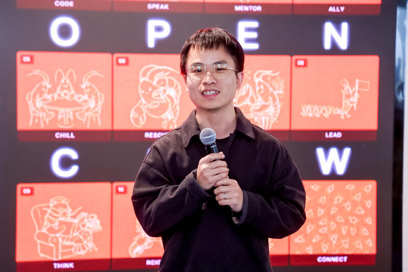
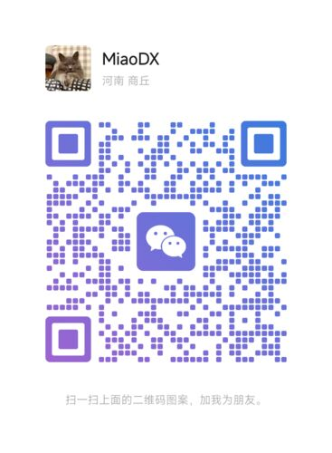

## 我是谁

**缪东旭（MiaoDX）**，目前在北京，长期在工程一线做 AI 与自动驾驶相关系统，正在把个人实践升级为新 OPC：「One Person + multi Claws」  
我希望把做事过程透明化，让更多人看到：AI Agent 不只是 demo，而是能真实创造交付价值的生产系统

## 学习与工作经历

- 2025-：Robotics Team @ XiaomiEV
- 2021-2025：Perception-System TeamLead @ XiaomiEV
- 2019-2021：DeepMotion.ai
- 2018：horizon.ai
- 2016-2018：TJU
- 2012-2016：xidian

## 内容主线

### [AI Coding × 机器人](/ai-coding/)

- Claude Code Routines、Harness Engineering、Ultrathink/Goal 等 AI Coding 工程化实践
- roboharness、roboclaws 等把 Coding Agent 带进机器人研发的开源项目
- 重点看 prompt、routine、harness、验收证据和长期 Agent 工作流

### [Best Practice](/bestpractice/)

- TOP AI Lab 的 Agent 工程实践拆解

### [归档 · OpenClaw 时期](/openclaw/)

- 2026 上半年用双 OpenClaw 实例运营的多 Agent 实验：部署、配置、事故复盘与经验规则
- 已停止更新，保留为历史记录

## 如何阅读这两个站点

- **LIP**：持续更新过程记录、复盘、规则和可分享材料
- **个人主页**：沉淀长期作品、经历与稳定的对外信息
- 你可以先在 LIP 看阶段性进展，再去个人主页了解完整背景

## 联系方式

  

    <h3>微信</h3>
    
  

  

    <h3>公众号</h3>
    
  

欢迎交流 AI Coding、OpenClaw 落地、演讲与咨询合作
