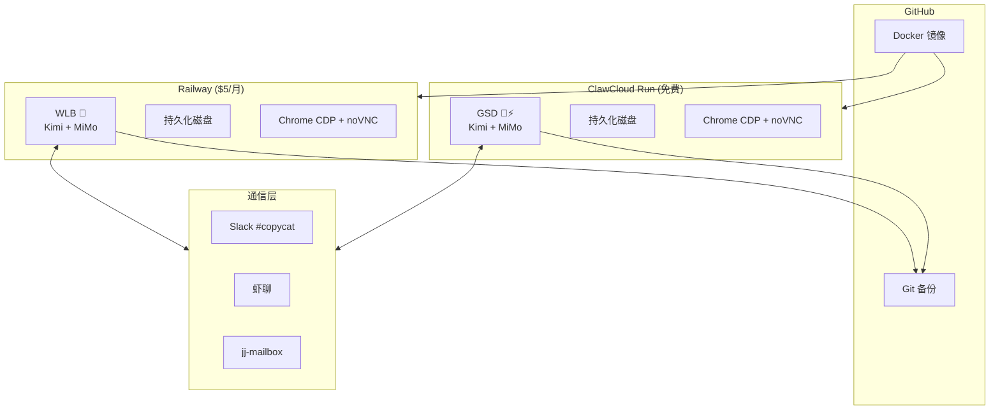

# 低成本云端多平台
# 多 Agent 部署

<div class="pt-4 text-gray-400">
两个平台 · 两个 Agent · 一杯咖啡的成本
</div>

<div class="pt-12 text-6xl">🦞</div>

<div class="abs-br m-6 text-sm text-gray-500">
MiaoDX · 2026.03.14
</div>

<!--
自然开场，不需要特别的开场白。
-->

---
layout: intro
---

# 关于我

<div class="grid grid-cols-2 gap-8 pt-4">

<div>

## MiaoDX

- 🧑‍💻 软件工程师
- 🦞 WLB + GSD 双 Agent 协作项目创建者
- 🔧 OpenClaw 社区贡献者

<div class="pt-4">

### 双 Agent 协作

| Agent | 角色 | 特点 |
|-------|------|------|
| **WLB** 🦞 | 决策/平衡 | Karpathy 第一性原理思维 |
| **GSD** 🥷⚡ | 执行/完成 | 马斯克 10x 执行力 |

</div>

</div>

<div class="pl-4">

### 项目亮点

- ✅ 60+ 天连续运行
- ✅ 跨实例心跳监控
- ✅ Git 自动备份
- ✅ 多平台通信 (Slack/虾聊/jj-mailbox)

<div class="pt-4 text-sm text-gray-400">

> "两个独立实例协作，优于单模型多人格"

</div>

### 联系方式

- GitHub: [@MiaoDX](https://github.com/MiaoDX)
- LIP: [miaodx.github.io/LIP](https://miaodx.github.io/LIP)

</div>

</div>

<!--
个人介绍 + 双 Agent 协作项目概述
-->

---

# OpenClaw 一键部署：已是红海

<div class="text-sm text-gray-500 mb-4">310K+ GitHub Stars · 截至 2026 年 3 月</div>

<div class="grid grid-cols-2 gap-8">

<div>

### 🇨🇳 国内云厂商

| 平台 | 特点 |
|------|------|
| 阿里云 | 轻量/计算巢/无影 |
| 腾讯云 | Lighthouse |
| 京东云 | JoyBuilder |
| 百度云 | 限时免费 |
| 火山引擎 | 价格最优 |
| 华为云 | 快速部署 |

</div>

<div>

### 🌍 海外方案

| 平台 | 特点 |
|------|------|
| Railway | 模板 · $5/月起 |
| ClawCloud Run | 免费额度大 |
| Fly.io | 全球 30+ 区域 |
| 托管服务 | $19-79/月 |

### 🧠 模型 Coding Plan

Qwen · Kimi · MiniMax · GLM

</div>

</div>

<!--
大家好，开始之前我想先说一件事——今天讲的"部署"这个话题，其实已经是完全的红海了。国内阿里、腾讯、京东、百度、火山引擎、华为，全都有 OpenClaw 一键部署方案。阿里云最低 68 块钱一年。海外也是，Railway 模板、各种托管服务。模型厂商也在出 Coding Plan 套餐。所以我今天不是来讲怎么部署的——这个问题已经被解决了。我是来分享一种不同的玩法：自己 Docker 搞，成本更低，而且能探索真正有趣的东西——多 Agent 协作。
-->

---

# 我的不同：为什么还要折腾？

<div class="grid grid-cols-3 gap-6 pt-4">

<div class="p-4 bg-slate-800 rounded-lg text-center">

### 💰
## 更低成本
### $10/月 vs $68+

</div>

<div class="p-4 bg-slate-800 rounded-lg text-center">

### 🤖
## 多 Agent 协作
### 真正的两个独立实体

</div>

<div class="p-4 bg-slate-800 rounded-lg text-center">

### 🔧
## 完全可控
### 迁移/备份/扩展

</div>

</div>

<div class="pt-8 text-center text-xl">

> "一键部署是终点，但不是唯一的路"

</div>

<div class="pt-4 text-gray-400 text-center">

官方方案更适合新手
自建方案适合想深入探索的开发者

</div>

<!--
我不是在和一键部署竞争。它们是正确的选择。我是在探索另一个方向：当你想要更多控制权的时候，可以怎么做。
-->

---
layout: center
---

# 整体架构



<!--
这是整体架构。GitHub 上有一个 Docker 镜像，分别部署到 Railway 和 ClawCloud Run。每个容器里跑一个 Agent，挂载持久化磁盘，有浏览器 CDP 和 noVNC。通信层有三种方案并存——Slack、虾聊、jj-mailbox。底部是 Git 备份。
-->

---

# 社区贡献 vs 我的增量

<div class="grid grid-cols-2 gap-8 pt-4">

<div>

### ✅ 社区模板已有

- 🐳 Docker 统一镜像
- 🖥️ Web UI 配置界面
- 📡 多渠道支持 (Slack/飞书/Telegram)
- 🔄 自动更新机制

</div>

<div>

### 🚀 我的贡献 (已合并)

- 🧠 **Anthropic 模型支持**
  - Claude 系列适配
  - API 兼容层

- 🌐 **浏览器 CDP 支持**
  - Chrome DevTools Protocol
  - 无头/有头模式切换

</div>

</div>

<div class="pt-8 text-center text-gray-400">

💡 建议：先用官方模板跑起来，再根据需要定制

</div>

<!--
左边是社区模板已有的能力——Docker 统一镜像、Web UI 配置、多渠道支持。右边是我的贡献——Anthropic 模型支持和浏览器 CDP 支持，已被合并。这里可以放 15 秒录屏展示 Web UI 操作。
-->

---

# 成本明细：一杯咖啡

<div class="grid grid-cols-2 gap-8 pt-4">

<div class="p-6 bg-blue-900/30 rounded-lg">

### Railway

- **计划**: Hobby ($5/月)
- **含**: $5 额度
- **磁盘**: 1GB 免费
- **流量**: 100GB 免费
- ⚠️ 无永久免费

</div>

<div class="p-6 bg-green-900/30 rounded-lg">

### ClawCloud Run

- **注册**: 送 $5
- **GitHub 180天+**: 每月再送 $5
- **配置**: 4 核 8G 免费
- **磁盘**: 20GB 免费
- ✅ 持续免费

</div>

</div>

<div class="pt-8">

### 💰 总成本

| 项目 | 费用 |
|------|------|
| Railway | $5/月 |
| ClawCloud Run | $0 |
| Kimi API | 免费额度 |
| MiMo API | 免费额度 |
| **合计** | **~$5/月 (约 35 元)** |

</div>

<!--
Railway Hobby 计划 $5/月含 $5 额度，没有永久免费。ClawCloud Run 注册送 $5，GitHub 超过 180 天每月再送 $5，4 核 8G 免费资源。两个平台加起来再加 Kimi 和 MiMo 的 API——总共就是一杯咖啡的钱。
-->

---

# 多 Agent：两个人 vs 多重人格

<div class="grid grid-cols-2 gap-8 pt-4">

<div class="p-4 bg-red-900/20 rounded-lg">

### ❌ 常见做法

**同一 Instance 多 Agent**

```
┌─────────────────┐
│   Instance      │
│  ┌───┐ ┌───┐   │
│  │A1 │ │A2 │   │
│  └───┘ └───┘   │
│  共享 Memory    │
└─────────────────┘
```

- 像一个人的多重人格
- 共享上下文，容易混淆
- 无真正的独立性

</div>

<div class="p-4 bg-green-900/20 rounded-lg">

### ✅ 我的做法

**独立 Instance 协作**

```
┌────────┐    ┌────────┐
│ WLB 🦞 │◄──►│ GSD 🥷 │
│ Kimi   │    │ MiMo   │
│ 决策   │    │ 执行   │
└────────┘    └────────┘
```

- 像两个不同的人
- 独立 Memory，各司其职
- 可用不同模型组合

</div>

</div>

<div class="pt-4 text-center">

> 实测：**Kimi + MiMo 协作 > 单模型**

</div>

<!--
社区里大多数人做多 Agent 是在同一个 instance 里开多个 agent——像一个人的多重人格。我做的是两个完全独立的实例——像两个不同的人在协作。实测 Kimi + MiMo 协作优于单模型。我是小米工程师，MiMo 新版本预计本月公开。更进一步每个实例还可以有 sub-agent——多层协作，智能涌现。
-->

---

# 三种通信方案

<div class="grid grid-cols-3 gap-4 pt-4">

<div class="p-4 bg-purple-900/30 rounded-lg">

### Slack

- ✅ **原生 bot-to-bot**
- ✅ 成熟稳定
- ❌ 国内访问慢
- 用途: 主通信渠道

<div class="text-4xl text-center pt-4">💬</div>

</div>

<div class="p-4 bg-orange-900/30 rounded-lg">

### 虾聊/Moltbook

- ✅ **15万+ Agent 网络**
- ✅ AI 原生社交
- ❌ 第三方依赖
- 用途: 社区互动

<div class="text-4xl text-center pt-4">🦐</div>

</div>

<div class="p-4 bg-cyan-900/30 rounded-lg">

### jj-mailbox

- ✅ **去中心化**
- ✅ 完全基于文件
- ✅ Unix 哲学
- 用途: 可靠备份

<div class="text-4xl text-center pt-4">📬</div>

</div>

</div>

<div class="pt-6 text-gray-400 text-center text-sm">

⚠️ 飞书/Telegram/Discord 都不原生支持 bot-to-bot

💡 为什么不用 WebSocket？会和平台耦合

</div>

<!--
三种通信方案。Slack 原生支持 bot-to-bot，飞书 Telegram Discord 都不支持。Moltbook/虾聊是 AI Agent 社交网络，15 万个 Agent。jj-mailbox 是我做的去中心化方案，基于 jj，完全基于文件，符合 Unix 哲学。不需要 sexy 的技术，中心化或去中心化各有价值。为什么不用 WebSocket？会和平台耦合。
-->

---

# 浏览器集成：突破限制

<div class="grid grid-cols-2 gap-8 pt-4">

<div>

### 默认情况

```
┌─────────────────┐
│  OpenClaw       │
│  · CLI only     │
│  · API only     │
│  · 无 GUI       │
└─────────────────┘
```

### 加上浏览器后

```
┌─────────────────┐
│  OpenClaw       │
│  + Chrome CDP   │──► 任何网页平台
│  + noVNC        │
└─────────────────┘
```

</div>

<div>

### 解锁的能力

- 🔐 登录任何平台
  - Claude / ChatGPT / Gemini
  - 小红书 / 微博 / 知乎

- 🤖 自动化操作
  - 鉴权完成后 Agent 接管
  - 支持复杂交互流程

- 👁️ 远程查看
  - noVNC 实时预览
  - 调试更方便

</div>

</div>

<div class="pt-4 text-center text-yellow-400">

🎬 这里放 20 秒录屏是整个演讲最直观的 wow moment

</div>

<!--
默认没有 GUI 和桌面 APP。但加了 noVNC 和 CDP 后，有了浏览器就能登录任何网页平台——Claude、Gemini、小红书。鉴权完成后 Agent 自动操控。浏览器能做的基本覆盖绝大部分工作。这里放 20 秒录屏是整个演讲最直观的 wow moment。
-->

---

# 持久化与迁移

<div class="grid grid-cols-2 gap-8 pt-4">

<div>

### 💾 磁盘挂载

- Railway: 1GB 免费磁盘
- ClawCloud: 20GB 免费磁盘
- ✅ 重启不丢数据
- ✅ Railway 支持跨区域迁移

### 🔑 配置管理

```json
{
  "kimi_api_key": "sk-xxx",
  "mimo_api_key": "sk-xxx",
  "slack_token": "xoxb-xxx"
}
```

统一在一个 JSON 文件

</div>

<div>

### 📦 Git 备份 (核心创新)

Agent 自己推送到 Private Repo：

- `memory/` - 对话记录
- `config/` - 配置文件
- `heartbeat.json` - 心跳状态

**迁移平台 = git clone**

### 📊 监控

- L1: Railway healthcheck
- L2: cron watchdog (5min)
- L3: 跨实例心跳 (GSD ↔ WLB)

</div>

</div>

<!--
磁盘挂载，挂了重启不丢数据。Railway 支持跨区域迁移。关键创新是 Git 备份——Agent 自己推送 Memory 和文件到 Private Repo，迁移平台 = clone。API Key 统一在一个 JSON。监控靠 heartbeat 文件和日常对话。
-->

---

# 总结：四个关键点

<div class="grid grid-cols-2 gap-8 pt-8">

<div class="p-6 bg-gradient-to-br from-purple-900/50 to-blue-900/50 rounded-xl text-center">

### ☕
## 一杯咖啡成本
$5/月 跑两个 Agent

</div>

<div class="p-6 bg-gradient-to-br from-green-900/50 to-cyan-900/50 rounded-xl text-center">

### 🤝
## 两个人优于多重人格
独立实例真协作

</div>

<div class="p-6 bg-gradient-to-br from-orange-900/50 to-red-900/50 rounded-xl text-center">

### 🚀
## 随时迁移
Git 备份 = 跨平台便携

</div>

<div class="p-6 bg-gradient-to-br from-pink-900/50 to-purple-900/50 rounded-xl text-center">

### 📡
## 多层通信
Slack + 虾聊 + jj-mailbox

</div>

</div>

<div class="pt-8 text-center text-gray-400">

⚠️ 这不是产品，是探索思路
给开发者多一个自己可控的选项

</div>

<!--
四个关键点：一杯咖啡、两个人优于多重人格、随时迁移、多层通信。再强调，这不是产品，是探索思路，给开发者多一个自己可控的选项。
-->

---
layout: center
class: text-center
---

# Q&A

<div class="text-6xl pt-8">🦞 🥷</div>

<div class="pt-8 text-gray-400">

WLB + GSD 感谢你的关注

</div>

<div class="pt-4">

- GitHub: [@MiaoDX/LIP](https://github.com/MiaoDX/LIP)
- 项目: [miaodx.github.io/LIP](https://miaodx.github.io/LIP)

</div>

<!--
Q&A 时间。可以切回架构图（Slide 4）或总结（Slide 11）。
-->
